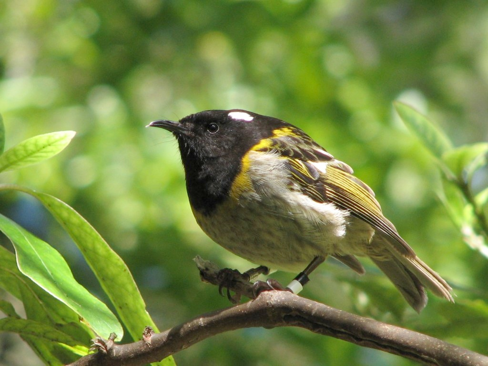

# Making decisions {#chap:sdm}

General Objectives:
1. Enumerate available management actions and assemble alternative strategies.
2. Make tradeoffs between competing objectives to select a preferred management strategy in an SDM framework.

## Learning objectives

At the end of chapter 2, the students should be able to:
1. Identify the main decision to tackle in a conservation oriented problem.
2. Identify the problem, objectives, actions, consequences, and tradeoffs in a conservation oriented problem. 
3. Differentiate between fundamental and means objective in a conservation oriented problem. 
4. Organize the consequences of each alternative for each objective into a consequences table. 

In Chapter \@ref(chap:fundamental) I defined a useful model as one that helps a manager make a decision. This means that an understanding of the process of decision making is fundamental to the process of modeling population dynamics in an applied setting, at least. **In this chapter I introduce the concept of structured decision making, a simple framework for making management decisions under risk and uncertainty.** 

I start with a simple example of a decision: whether or not to provide supplemental food to a population of Hihi, an endangered bird in New Zealand (Figure \@ref(fig:hihi)). Managers at Kapiti Island want to provide nectar feeders to support recently translocated Hihi because they believe that the vegetation in the new location is not as rich in nectar sources as the island from which they came. They believe that additional food will support population growth in the translocated population by either improving adult survival or the number of offspring produced per pair. What they do not know is how much food to provide, or whether some other aspect of the environment in Kapiti Island will limit population growth despite increases in food availability. Concerns have also been expressed that Hihi will become dependent on feeders, and unable to utilize natural food sources. 

```{r hihi, fig.cap='The hihi, or stichbird. Image by digitaltrails. http://www.flickr.com/photos/digitaltrails/87192080/ (CC BY-NC-SA 2.0)', out.width="70%"}

```

Although this is a relatively simple decision, it has all the features that make decisions complicated and difficult. There are multiple competing outcomes, multiple ways of reaching those outcomes, and uncertainty about which actions will lead to which outcomes. In the face of all this complexity, it is very human to avoid making a decision --- which is itself a decision with outcomes --- and focus on acquiring more information or attempting to pass responsibility for the decision onwards. Research throughout the 20th century has documented the many ways in which human cognition fails when faced with complex decisions. Psychologists have also studied ways in which to help humans make decisions in such circumstances. In this book I will introduce a simple 5 step approach to decision making (Smart Choices reference) that can help overcome the psychological traps of decision making; **it has a simple easy to remember acronym PrOACT, reminding you to be proactive in decision making. The five steps are: Problem, Objectives, Actions, Consequences, Tradeoffs.**

## Problem

The first step in making a decision is to ensure that you are in fact making the correct decision. What is the problem that has to be solved? Who has to solve that problem? Correctly identifying both the problem and the problem solver is critical to making a good decision. If the problem you think you’re trying to solve is in fact a decision at a higher level of organization, then no matter how good your decision making is you will not be able to solve the problem. Someone else is making the decision. You may be able to advise that person, but that is a very different role than directly making the decision yourself. 

What is the problem to be solved in the Hihi example? Is it identifying the direct effects of food supplementation on adult survival? What kind of monitoring program should be in place? How many translocated populations should receive food supplementation? All of these are legitimate questions. **The key to identifying the right problem to solve is to focus on things that are under the control of the decision maker.** If the manager of Kapiti Island is the decision maker, then deciding which translocated populations should receive food supplementation is beyond her scope --- that will be decided by someone else. Similarly, a management problem will typically involve a choice among alternatives, rather than a resolution of an uncertainty. Identifying the direct effects of food supplementation on adult survival, while potentially useful information, does not involve a choice between alternatives by the decision maker. Choosing what to monitor in the park, and how, is a choice among alternatives – there are many things that could be measured. Similarly how many feeders and where to place them leads to choices among alternatives by the manager of Kapiti Island. 

Careful thought about who is making the decisions, and what decisions they have to make, is a critical first step in problem solving, and often the most neglected. The more effort devoted to this step the better, although it is also possible to get bogged down at this stage. Rather than attempting to solve all of the problems at once, it is useful to tackle individual decisions completely, and sequentially. Sometimes the solution to one problem turns out to depend on the solution to a different problem -- the decisions are linked. Linked decisions are more complex than decisions that can stand alone, but breaking linked decisions into separate problems and tackling each independently makes it easier. In the Hihi example, the choice about what to monitor and how depends to a great extent on what choices are made about feeding stations. So first laying out the feeding station decision will provide a great deal of information about how to solve the monitoring problem.

## Objectives

Once the problem has been (tentatively) decided on, the next step is to determine how to measure success. The terms used for measuring success vary widely, and different texts will argue for critieria, metrics, goals, objectives, targets and many others besides. I will try to keep it simple. **An objective is an attribute of the system being managed that has some value to the decision maker.** In the Hihi example, the number of adult Hihi in Kapiti Island is a measurable attribute. The annual adult survival probability is another measurable attribute. The number of feeding stations in the park is a measurable quantity as well. How do you decide which and how many objectives are necessary?

One approach to this problem is to categorize the measurable quantities into either means objectives or fundamental objectives. Distinguishing between these two is relatively easy. For each putative objective, you must ask yourself, "why does this matter?". If the answer is simply, "because it does", then the objective is likely a fundamental objective. In contrast, if the answer is "it helps achieve objective X", then it is a means objective --- a useful step, but not of interest in and of itself. 

Take a look at the quantity "number of feeding stations in Kapiti Island". Does the manager care about this quantity? If there were no Hihi, would having 5 or 10 stations be better than having none? If yes, then the number of feeding stations would be fundamental --- more feeding stations is better, regardless of what else is happening. However, this seems unlikely. The only reason for feeding stations is to help the Hihi population, so this is  a means objective rather than a fundamental objective. 

In contrast, asking is 20 Hihi better than zero Hihi leads to a different conclusion -- regardless of what else is happening in the park, 20 Hihi are better than none. The population size of Hihi on Kapiti Island seems like a fundamental objective, at least for this decision. The adult survival probability is an example of a more difficult objective. All other things equal, is a population with higher survival better than a population with lower survival? Imagine that there are 100 Hihi in the park, but you can have 100 birds with an annual survival of 0.85, or 100 birds with an annual survival of 0.9. Which is better? This is not so straightforward to sort out, and the answer may well depend on other vital rates of the population, and how they vary with population size. For example, what if the population of 100 with a low adult survival rate is only maintained by continued immigration from another population? The population in Kapiti Island is then a sink, and could be causing the larger metapopulation of Hihi to be lower than it otherwise would. 

This sort of complex interaction between potential objectives is not uncommon in fisheries and wildlife management problems. A more nuanced approach to the means vs. fundamental dichotomy is to construct an objectives hierarchy. Each potential objective is given a node, and then connections are made between nodes in order to identify causal relationships between them (see Figure \@ref(fig:hihi-objectives)).

```{r hihi-objectives, fig.cap='An objectives hierarchy for the hihi feeding problem.'}
knitr::include_graphics("images/hihi_objectives_hierarchy.png")
```

## Alternatives

Once the objectives are described, the next step is to lay out all the alternatives, the different possible choices that can be made. This step is crucial, and requires creativity. It is all too easy at this stage to fall into the trap of only specifying alternative outcomes that are thought to be acceptable. The key is to lay out the broadest range of alternatives possible --- even if you think some of them are impossible to achieve. The subsequent exercise of evaluating the consequences and tradeoffs will demonstrate which alternatives are impossible, but may also help to identify new alternatives that had not been previously considered. This is especially true for combinations of alternative actions. 

**A good source for alternatives is to examine the lower end of the objectives hierarchy – those "means objectives" that are not ends in themselves, but lead to improvements in the fundamental objectives. In many instances these are attributes of the system that can be manipulated, not just measured.** In the Hihi feeding station problem, the obvious place to start is with the number of feeding stations. This is something that is under the control of the park manager. Keeping a broad mind about the alternatives suggests we should consider everything from placing no feeding stations to placing many more than have been tried in the past. We should also consider alternatives about where to place the stations. Hihi management also involves placing nestboxes, so feeders should only be placed where there are nest boxes, but how many feeders per nestbox? Should we put feeders with all nestboxes? Do we need to maintain the feeders year round, or only during the breeding season? Suddenly we have many more things that we can manipulate than we expected! For the purposes of this example, let us define 5 alternatives as combinations of 0, 1 or 2 feeders per nest box, and maintaining feeders either year round or only in the breeding season. We end up with 5 alternatives, rather than 6, because 0 feeders per nest box doesn’t require choosing a duration of feeding.

## Consequences

Once we have our objectives and alternatives, the next step is to articulate the consequences of each alternative for each objective. One of our objectives is the number of Hihi, so this is the part where modeling population dynamics comes in. In essence, we want to predict what the population size will be in the future for each of our alternatives. This step is also where we find out how much we really know about the system we are trying to manage. 

Predicting consequences doesn’t have to be hard. For a first cut at a problem, it can simply be a statement of what relevant experts think will happen. Even ranking alternatives can be sufficient as a starting point, and that can usually be done with relatively little information.

The easiest way to visualize the consequences is to make a table with each of the alternatives on the rows and each of the objectives on the columns. This is called the protoype consequences table. The first column should have the fundamental objective. Each cell has the ranking of each alternative for each objective, with 1 being the lowest rank possible for each alternative. 

For the Hihi problem, I started by assuming that no feeding stations would be the worst for population size and adult survival, and of course, have the lowest cost (Table \@ref(tab:hihi-con1)). I also assumed that having 2 feeding stations per nest box would have the largest effect on population size, and be the most expensive. Notice that all options are tied for adult survival --- this is because further consulting with experts (i.e. reading) revealed that supplementary feeding affects reproduction but not survival. That last observation led me to suppose that having 2 feeding stations only during the breeding season would have an equal effect on population size as maintaining the stations year round, but would of course be cheaper. By analogy then, having 1 feeding station all year will be equivalent to 1 feeding station for the breeding season, but both are worse than having 2 stations. Finally, I assumed that having 2 feeding stations for the breeding season would cost the same as having 1 station for the entire year, and having a single station just for the breeding season was the cheapest next to having no stations at all. 

```{r hihi-con1}
hihicon1 <- readr::read_csv(
"0 FS, 1, 1, 1
1 FS all year, 2, 3, 1
2 FS all year, 3, 4, 1
1 FS breeding, 2, 2, 1
2 FS breeding, 3, 3, 1", 
col_names=c("Alternative","# of Hihi","Cost","Adult Survival") )
knitr::kable(hihicon1, caption="Prototype consequences table for the Hihi feeding problem. The ranking goes from 1 to 4, where the lowest ranking (1) is assigned to the least preferred alternative.", booktabs=TRUE)
```


## Tradeoffs

The final step in the process is to examine the consequence table to identify strategies or alternatives that perform the best. If you’re lucky, there’s one alternative that beats all others. Most of the time, you’ll not be so lucky, and there will be some alternatives that win on one objective, and others that win on a second objective. Somehow the different objectives must be "traded off" against one another. There are many ways of doing this, and for the most part these boil down to weighting the objectives in some fashion. But before getting to that level of complexity, it is always worthwhile to see if the decision problem can be simplified. 

The first tactic for simplification is to examine the objectives and see if any of them are uninformative. **An uninformative objective is one that does not distinguish among the alternatives. If it isn’t distinguishing among the alternatives, then in effect it can be ignored.** In the Hihi problem adult survival is uninformative (Table \@ref(tab:hihi-con1)); it has the same value for all alternatives. So we can simply remove it from the consequences table, and proceed with a problem that is now much simpler --- only 2 objectives to worry about instead of 3 (Table \@ref(tab:hihi-con2)). 

```{r hihi-con2}
hihicon2 <- readr::read_csv(
"0 FS, 1, 1
1 FS all year, 2, 3
2 FS all year, 3, 4
1 FS breeding, 2, 2
2 FS breeding, 3, 3", 
col_names=c("Alternative", "# of Hihi", "Cost") )
knitr::kable(hihicon2, caption="Consequences table for the Hihi feeding problem after simplifying by removing irrelevant objectives.", booktabs=TRUE)
```

The second tactic for simplification is to look for strategies that are "completely dominated" by one or more strategies. That is, the alternative performs equal or worse on every single objective. For example, take a look at the second alternative: single feeding station for the entire year. It costs more (3 vs 2) and has the same effect on population size (2 vs 2) as the single feeding station in the breeding season alternative. So, in this simple prototype of the decision problem, there would be no circumstances in which we would choose to run the feeding station for the entire year. If there were, then that would suggest that there is a fundamental objective that has not been captured, or perhaps our ranking of alternative performance is incorrect. In contrast, compare the no feeding stations alternative with the single station for the breeding season alternative. No feeding station is cheaper, but the single breeding season station does better for population size. In this case, there is no way to eliminate one of these alternatives --- we will be forced to trade off the cost against the benefit to the population size.

A similar argument allows us to eliminate the alterative with 2 feeding stations for the entire year --- it does not perform better in any respect than 2 feeding stations just in the breeding season. We now have a much simpler problem to look at --- just 3 alternatives and 2 objectives (Table \@ref(tab:hihi-con3)). At this point we could try the 1st simplification tactic again --- having eliminated some alternatives can leave some objectives irrelevant to the remaining set. However, in this case we’ve gone as far as simplification can get us. Now we need to do something more complex. It turns out that one of the flaws of ranking alternatives now comes back to bite us. 

```{r hihi-con3}
hihicon3 <- readr::read_csv(
"0 FS, 1, 1
1 FS breeding, 2, 2
2 FS breeding, 3, 3", 
col_names=c("Alternative","# of Hihi", "Cost") )
knitr::kable(hihicon3, caption="Consequences table for the Hihi feeding problem after simplifying by removing dominated alternatives.", booktabs=TRUE)
```

Ranking destroys any information (or in this case, I never elicited that information) about how far apart each alternative is on that objective. For example, probably the biggest cost of maintaining the feeding stations is the personnel needed to visit each station. However, in this case, someone has to visit each nest box anyway to check for parasites. So as long as visits to feeding stations don’t need to happen more often than visits to nest boxes, the cost difference between the no feeding station alternative and the single station is not that great. In contrast, the increase to having 2 feeding stations could be larger, as now more material will have to be carried in rough terrain, and more travel between feeding stations will be required. Exactly how we resolve the tradeoffs between cost and population size benefits will depend a great deal on details like this. But now, instead of trying to worry about everything, we are very focused on the particular details that distinguish the remaining alternatives from each other. 

So let's fill in the final table called "Weighted consequences table" with some values that have meaningful units on them. After some discussion, we decide that one feeding station doesn't take extra time, but having 2 stations to visit will take an extra hour, on average. We'll measure the population size relative to the change obtained by putting in one feeding station, so the 1 feeding station alternative gets a value of 1, and the value for 2 feeding stations will give us the proportional improvement for a second feeding station (Table \@ref(tab:hihi-con4)). Now we revisit our simplification tactics, and we can see that the no feeding station alternative is completely dominated by the single feeding station alternative. We're really getting somewhere now! The problem has reduced down to determining if an extra person-hour per week is worth a hypothesized 50\% increase in population size. 

```{r hihi-con4}
hihicon4 <- readr::read_csv(
"0 FS, 0, 0
1 FS breeding, 1, 0
2 FS breeding, 1.5, 1", 
col_names=c("Alternative",
            "# of Hihi [increase relative to 1 feeding station]",
            "Cost [extra person-hours/week]") )
knitr::kable(hihicon4, caption="Weighted consequences table for the Hihi feeding problem after converting consequences to meaningful units.", booktabs=TRUE)
```

I added a new word to the description in the last paragraph: hypothesized. This emphasizes something that we’ve so far ignored. To some extent, all of the rankings and quantities that we used so far are uncertain --- we do not know them exactly. And in many cases they will in fact vary naturally --- the amount of work required to maintain one or two feeding stations per nestbox probably varies by nestbox. The terrain is different, the stations are harder to travel between, the liquid in the feeding stations evaporates faster on warmer days, and so on. This kind of variation can make a big difference when making tradeoffs between objectives, because it introduces risk into the equation. It is possible that we will not obtain the benefits we seek, or that the costs will be higher. 

In the case of the improvement in population size, I've hypothesized that 2 feeding stations are better than one, but not twice as good. I'm not very certain about that however; it could be as low as 1 (no improvement at all) to as high as 2. There are many methods for proceeding in the face of uncertainty like this, but for the moment, I will stick with the point estimate. I feel that the extra benefit is not worth the extra cost. As long as the population is increasing, I am satisfied that we are meeting the overall goal, and therefore I choose the less expensive alternative. 


## Exercises

**A. Comprehension: **
1. Explain the Structured Decision Making (SDM) framework and why it is useful for wildlife management. 
2. Enumerate three key components in identifying the right problem to solve in a wildlife management problem?
3. What are the differences between a fundamental and a means objective?
4. Explain how a consequences table can help wildilfe managers solve problems.

**C. Problem solving: **

1.  The Department of Fish and Game in Nunivak Island AK face a problem with muskox. They need to award a number of hunting permits (one permit allows for hunting one muskox) the following year. Table \@ref(tab:muskox-con1) has the consequences of a decision about how many Muskox to remove from Nunivak Island AK. Based on that table, identify the following: 

a. What are the fundamental and means objective for the muskox problem? *Note: the objectives are in no particular order*
b. Are there any uninformative objectives on the consequences table for the muskox problem. Justify your answer. 
c. Identify all the alternatives that are completely dominated by one or more strategies. 

```{r muskox-con1}
muskoxcon1 <- readr::read_csv(
  "None,           0, 0,  750, 56:44
10 % of total,     1, 1,  700, 56:44
20 % of females, 2.5, 1.5,500, 70:30
20 % of total,     2, 1.2,600, 56:44", 
col_names=c("Alternative",
            "Cost [$]",
            "Range Condition",
            "Total Population, April",
            "Herd sex ratio [males:females]") ,
col_types = "cddic")
knitr::kable(muskoxcon1, caption="Consequences table for Muskox removal problem.", booktabs=TRUE)
```

2. Read the problem description for wild horse management. And answer the following questions: 
a. Identify the problem and problem solver. 
b. Draw up a proposed objectives hierarchy for the managers to consider. Identify the fundamental and means objectives. 

### Wild horses in the American Southwest {-}

Wild horses have roamed the west since their re-introduction to North America by the Spanish Conquistadors. Most of these horses occur on land managed by the Bureau of Land Management, and since 1971 the Wild Free-Roaming Horses and Burro's Act has stipulated what BLM can and cannot do to manage this population. The BLM and other federal agencies are supposed to monitor horse numbers, and ensure that they "preserve and maintain a thriving natural ecological balance." Although current management targets a maximum population of 23,622 horses across 179 management units, the current free-roaming population exceeds 33,000. Political pressure means that BLM is not able to cull horses, instead relying on capture and adoption to reduce wild populations. Unfortunately adoption demand is usually much less than the number of horses captured, and as a result there is a burgeoning captive herd of around 45,000 horses that must also be maintained. A few horses are sold, but most remain in captivity until they die of natural causes.  

Garrott and Oli (2013) worked out that the captive population would stabilize around 60,000 horses by 2027 representing a balance between natural deaths and new captures from the wild. Caring for these animals will cost in excess of \$100 million dollars per year; the 2012 budget for the Wild Horse and Burro program was \$74 million, of which 60\% is used to care for captive horses. 

A National Research Council report (NRC 2013) on wild horses and burros concluded that if removals from the free-roaming population ceased, the population would grow unchecked until food and water became limiting. At that point the horses would be in poor health, and rangelands would be degraded affected native species and other public uses (grazing, hunting). 

# References 

Garrott, R.A. and M.K. Oli (2013) A critical crossroad for BLM's Wild Horse Program. Science, 341:847-848.

NRC (2013) Using Science to Improve the BLM Wild Horse and Burro Program: A Way Forward. National Academies Press, Washington, DC.
