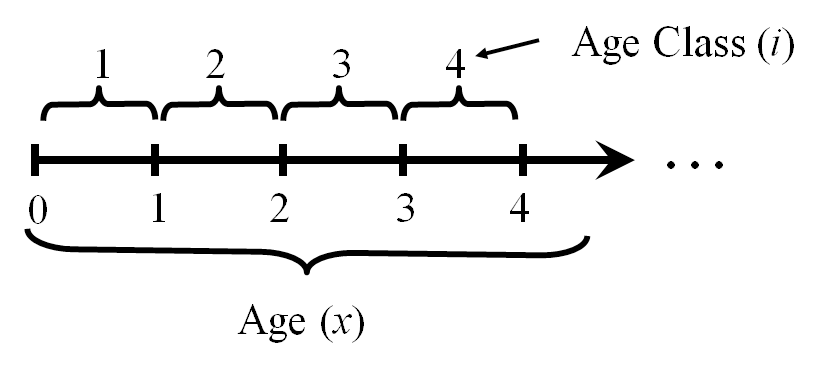

# Structured Populations {#chap:structured}

In previous chapters we've treated all individuals in a population as if they are identical and equally able to interact. However, this is manifestly not true. Individuals vary by age, size, gender, genotype and location, at a minimum. This heterogeneity affects everything in the fundamental equation. Individuals of different ages have different survival probabilities. Individuals of different genders have different probabilities of dispersing. Sometimes management actions affect old individuals, sometimes young ones, and sometimes only a part of the area occupied by a population. How can we incorporate this heterogeneity into our population models?

## Age structure

For long lived vertebrates, age is often the most obvious distinguishing feature. Older animals are often larger, have higher and more constant survival rates (Gaillard et al 2008), and produce offspring more successfully than younger animals. Age has obvious advantages as a means of distinguishing between animals, as an animal that survives from one year to the next is one year older. Nonetheless it is not trivial to estimate the age of free living vertebrates.  

Age structured population models typically *project* the population from one time step to the next. This is a discrete time approximation to the population dynamics. The time step can be anything, from a day (e.g. Tenhumberg et al 2011) to a year (e.g. Post van der Burg et al 2009). For long lived vertebrates in the temperate zone a year is a good place to start. The basic state variable for an age structured population model is a vector describing the number of individuals in each age class in a particular year $t$

\begin{equation*}
N_t=\begin{bmatrix} n_{1,t} \\ n_{2,t} \\ \vdots \\ n_{m,t} \end{bmatrix}\,.
\end{equation*}

The number of age classes is $m$. For the moment ignore differences between genders. What does the number $n_{1,t}$ represent? To answer this question, we have to specify a few more assumptions about the model. In particular, we have to describe the relationship between the census (the point in time where the individuals are counted), and when reproduction occurred.

There are two general ways to describe reproduction in these models. The *birth flow* assumption means that reproduction occurs continuously between $t$ and $t+1$. In contrast, the *birth pulse* assumption means that reproduction occurs in a single pulse at some point between $t$ and $t+1$. In temperate environments the birth pulse assumption often works very well. Many species give birth in distinct seasons much shorter than the annual cycle. Regardless of which way we describe reproduction, individuals that are between age $i-1$ and $i$ are in age class $i$ (Figure \@ref(fig:agestructure1)). In a birth pulse model, all individuals have the same birthday (Figure \@ref(fig:agestructure2)). We won't consider the birth flow assumption further in this textbook. If this assumption seems more relevant to your system, you should consult Caswell (2001) --- the authoritative reference on the construction and analysis of structured population models. 

```{r agestructure1, fig.cap="The relationship between age classes and ages in an age structured model. The vertical bars represent birth days."}

```

```{r agestructure2, fig.cap="In a birth pulse model, everyone has the same birthday, and all reproduction occurs on the birthday."}
knitr::include_graphics("images/agestructure2.png")
```


The next step is to decide when the census occurs relative to the birth pulse. This is often determined by how data on population size are being collected. For example, if the model is constructed from age at harvest data for white tail deer, the census (hunting season) occurs about 6 months after the birth pulse. If you are counting male and female prairie chickens on leks, then the census is taking place immediately prior to the pulse of reproduction (egg laying, incubation hatching and fledging). The most common assumptions are either immediately before or after the birth pulse. These are referred to as "pre-breeding" or "post-breeding" census models (Figure \@ref(fig:agestructure3)).

```{r agestructure3, fig.cap="In a post-breeding census model, the state of the population is captured right after breeding. In a pre-breeding census model, the state of the population is captured right before breeding occurs."}
knitr::include_graphics("images/agestructure3.png")
```

Now we are ready to answer the question posed above. In a pre-breeding census model $n_{1,t}$ represents individuals that were born in the previous birth pulse, one year previously. That is, this is the number of individuals about to have their first birthdays. Consequently, $n_{2,t}$ represents those individuals that are about to have their second birthdays, and so on. In a post-breeding census model $n_{1,t}$ represents individuals that have just been born, while later age classes $i$ are individuals immediately following their $(i-1)^{th}$ birthdays. Age class 2 individuals have just had their first birthday. This may seem very pedantic, but these choices actually matter alot when translating biological data on birth and death rates into an age-structured population model. 

### Projecting an age structured population {-}

I will first describe how to calculate the population next year from this years population for a simplified model with two age classes. Then I will show how to use matrix arithmetic to do this easily for a model with any number of age classes. 

Imagine a bird something like a prairie chicken. I census these birds while they are lekking, prior to when the hens lay eggs and produce the next generation. Then birds in the first age class are last year's fledglings that survived for an entire year to their first birthday. This is a *pre-breeding census* model. Birds in the second age class come from two sources. They are last years age class 1 birds that have survived to reach their second birthday. Also, birds that were in the 2nd age class last year may have survived to reach their 3rd or later birthdays. Therefore

\begin{align}
(\#eq:firstclass)
n_{1,t+1} & = n_{1,t} F_1 S_0 + n_{2,t} F_2 S_0 \\
(\#eq:secondclass)
n_{2,t+1} & = n_{1,t}S_1 + n_{2,t}S_2
\end{align}

In these equations $S_i$ is the survival probability from age $i$ to age $i+1$, and $F$ is the number of individuals born to an individual of age class 2. So $S_1$ is the probability of surviving from age 1, in the census right before the first birthday, to age 2, in the census right before the second birthday. The first equation \@ref(eq:firstclass) says that the number of age class one individuals in year $t+1$ is the sum of two terms. The first term is the product of the number of age class 1 individuals in year $t$, the number of offspring produced by each individual, and the probability that new borns survive to their first birthday. The second term is the same, representing the reproductive contribution from age class two individuals. The second equation \@ref(eq:secondclass) says that the number of age class two individuals in year $t+1$ is the sum of age class one and age class two individuals that survived from $t$ to $t+1$. This life history can be represented graphically by putting the connections between the states as arrows (Figure \@ref(fig:Chicken1)).

```{r Chicken1, fig.cap="Life history diagram of a Pseudo-chicken."}
knitr::include_graphics("images/chickens1.png")
```

I'll start by filling in some numbers for my life history parameters. $F_i$ is the number of fledglings produced per individual of age $i$. Hens lay 15 eggs, but the probability of each egg surviving to fledge is only 25\%, and half of the eggs are males. So I can set $F = \frac{15 \cdot 0.25}{2} = 1.88$. Dividing by 2 is necessary because only the females lay eggs, but assumes that the sex ratio is equal and males are not limiting reproduction. Just for simplicity, we also assume that age 1 and age 2+ females lay the same number of eggs. 

Survival from fledging to a bird's $1^{st}$ birthday, $S_0$, is one of the most poorly measured life history parameters ever. It is very difficult to estimate, especially for migratory birds. For illustration purposes I'll set $S_0 = 0.25$, but you should realize how much that's a shot in the dark. Survival of adult birds is easier to estimate, but I'll just set $S_1 = S_2 = 0.5$ for now. If I have a population of 100 age 1 birds at time $t$ then

\begin{align*}
n_{1,t+1} & = 100 \cdot 1.88 \cdot 0.25 + 0 \cdot 1.88 \cdot 0.25 = 47\\
n_{2,t+1} & = 100 \cdot 0.5 + 0 \cdot 0.5 = 50\,.
\end{align*}

So my total population at time $t+1$ is 97. Repeating the process

\begin{align*}
n_{1,t+2} & = 47 \cdot 1.88 \cdot 0.25 + 50 \cdot 1.88 \cdot 0.25 = 55\\
n_{2,t+2} & = 47 \cdot 0.5 + 50 \cdot 0.5 = 49\,.
\end{align*}

and now my total population is 94. I could keep going with these equations, but the math is getting tedious. These equations can be readily automated in a spreadsheet, but there is a better way that leads to greater insights into the dynamics of structured populations. 

## Population Projection Matrices

Equations \@ref(eq:firstclass) and \@ref(eq:secondclass) can be written down as the *matrix product* of a vector and a square matrix

\begin{equation}
  \mathbf{N_{t+1}} = 
  \begin{bmatrix} 
  n_{1,t+1} 
  \\ n_{2,t+1}
  \end{bmatrix} =
  \begin{bmatrix}
  F_1S_0 & F_2S_0 
  \\ S_1 & S_2
  \end{bmatrix} 
  \begin{bmatrix} 
  n_{1,t} 
  \\ n_{2,t}
  \end{bmatrix} 
  = \mathbf{A N_{t}}\,.
  (\#eq:matrix1)
\end{equation}

The matrix $\mathbf{A}$ is called a population projection matrix. It is always square, with as many rows as there are age classes in the population. The vector $\mathbf{N_t}$ represents the state of the population at time $t$, and has one entry for each age class. You could be forgiven for wondering how \@ref(eq:matrix1) is an improvement over \@ref(eq:firstclass) and \@ref(eq:secondclass). It turns out that there are many calculations that can be done with $\mathbf{A}$ that allow us to understand the dynamics of any population. 

### Growing or Declining? {-}

Take a careful look at the elements of the matrix $\mathbf{A}$. None of them depend on the size of the population. Therefore this simple population model is *density independent*, which means that it will either grow or decay without limit. One way to see which of these will happen is to simply repeat the matrix multiplication many times, and see what happens (Figure \@ref(fig:projectA)). In this case, the reintroduced population declines steadily. In fact, it looks like the total population size is decreasing exponentially at a constant rate. $N_2 = 97$ while $N_3 = 94.1$, so the change is $94.1/97 = 0.97$. We get the same value comparing $N_{10} = 76$ with $N_{11} = 73.4$. It is as if our population is decreasing geometrically, the same as an unstructured population. Moreover, the proportion of age class 1 and 2 individuals in the population is constant too, after the blip caused by starting with everyone in age class 1. So in effect I would have exactly the same prediction from a simple geometric model with $\lambda = 0.97$.  

```{r projectA,echo=FALSE,fig.cap="Projecting the pseudo-chicken population forwards in time. ",message=FALSE}
library(popbio)
old.par=par(mfrow=c(1,2),pty="s")
A = matrix(c(1.88*0.25,0.5,1.88*0.25,0.5),nrow=2)
N = matrix(0,nrow=2,ncol=20)
N[,1] = c(100,0)
for (t in 2:20){
  N[,t] = A %*%N[,(t-1)]
}
N = rbind(N,colSums(N))
matplot(t(N),xlab="Time",ylab="Population size",type="l")
legend(8,100,bty="n",legend=c(expression(n[1]),expression(n[2]),"Total N"),lty=1:3,col=c("black","red","green"))
plot(1:20,N[2,]/N[3,],type="l",lwd=3,xlab="Time",ylab="Proportion in age class 2")
par(old.par)
```

In this first example, the life history parameters are identical for both age classes. But what happens if older chickens reproduce better? Experience counts for birds too --- older hens have more experience in where to place nests, often nest earlier and so forth. Thus it is entirely reasonable that $F_2 > F_1$, so lets set it to 2.5 and see if that makes a difference (Figure \@ref(fig:projectB)). And it does! Now the population is increasing, but only after year 3. In the first year the total population size still shrinks. This makes sense, because I started with all age class 1 birds and their fertility is still the same. Once there are some age class 2 birds, in the second year, the population begins to grow because of the higher fertility of older birds. The rate of growth still looks pretty constant at $~1.04$, and after the 4th year the proportion of age class 2 birds is again constant. So I'm back to a geometric model, but it took a bit longer to get there.   

```{r projectB,echo=FALSE,fig.cap="Projecting the pseudo-chicken population forwards in time with a higher Fertility for age class 2. "}
old.par = par(mfrow=c(1,2),pty="s")
A = matrix(c(1.88*0.25,0.5,2.5*0.25,0.5),nrow=2)
N = matrix(0,nrow=2,ncol=20)
N[,1] = c(100,0)
for (t in 2:20){
  N[,t] = A %*%N[,(t-1)]
}
N = rbind(N,colSums(N))
matplot(t(N),xlab="Time",ylab="Population size",type="l",lwd=3)
legend(0,220,bty="n",legend=c(expression(n[1]),expression(n[2]),"Total N"),lty=1:3,col=c("black","red","green"),lwd=4)
plot(1:20,N[2,]/N[3,],type="l",lwd=3,xlab="Time",ylab="Proportion in age class 2")
par(old.par)
```

It turns out that for any particular population projection matrix, there is a specific distribution of individuals among age classes that make the matrix behave as if it were a scalar multiplier. This is actually true of any square matrix with non-negative entries. In addition, no matter what age distribution of individuals I start with, the age distribution converges towards this special distribution. Depending on the particular structure of the matrix and the starting distribution of individuals, this convergence can be rapid or it can be slow, but it always happens. This special age distribution is called the "stable age distribution". It is important to recognize that the *proportion* of individuals in each age class is stable. The number of individuals is still changing. This makes the stable age distribution different from the stable points found in the Logistic population growth models. **When the population is at the stable age distribution, it will grow (or decay) geometrically at a constant rate.** The symbol for that growth rate is typically $\lambda$. **When $\lambda = 1$ the population is neither growing nor declining**.

It is possible to find the value of $\lambda$ and the stable age distribution without multiplying the population out until it has stabilized. When the population is at the stable age distribution, then 

\begin{equation*}
\mathbf{Av} = \lambda\mathbf{v}.
\end{equation*}

where $\mathbf{v}$ is a vector. This equation is called the "characteristic equation" of a square matrix. The values of $\lambda$ and $\mathbf{v}$ that make this equation true are candidates for the population growth rate and stable age distribution. There will be as many solutions as there are rows in the matrix. The values of $\lambda$ are called "eigenvalues" of the matrix, and the corresponding vectors are "eigenvectors". While the math to find these values is not easy (use a computer!), once you have these solutions the only one we want is the largest real eigenvalue. That will be the growth rate of the population when it is at the stable age distribution, and the stable age distribution is given by the matching eigenvector. I will never expect you to calculate the eigenvalue and eigenvector. You should know that

1. **the population growth rate for a structured population at the stable age distribution is the *leading eigenvalue* of the projection matrix** 
2. **the stable age distribution is predicted by the *right eigenvector* of the leading eigenvalue.** 

You can always find these values using the multiplication method used in Figures \@ref(fig:projectA) and \@ref(fig:projectB) in a spreadsheet. 

## A more complex example

This next example shows how to build up a matrix from data on the number of individuals of each age in a population over a period of years. The data are from a study of great tits (*Parus major*) in the United Kingdom (Table \@ref(tab:greattits)). If you sum up the # of birds columns, that is the total population size in each year. Average reproductive performance also varies from year to year. This variation is the result of both environmental variation between years as well as demographic stochasticity. In addition, the reproductive output of the age 1 birds is a bit lower than that of older birds. There might also be a tiny hint of "senesence", or aging, as the oldest age classes also have lower reproductive output. Survival from one age class to the next can be worked out by working diagonally across the table. For example, birds that are 2 years old in 1962 were 1 year olds in 1961. Therefore the survival probability is $43/128 = 0.34$. The corresponding probability from 1962 to 1963 is $33/54 = 0.61$, much higher than the survival rate from the previous year. 

```{r greattits}
pm_lt <- readr::read_delim(
"Age & # of birds & Mean Clutch & # of birds & Mean Clutch & # of birds & Mean Clutch
1   & 128         & 7.7         & 54          & 8.5         & 54          & 9.4        
2   & 18          & 8.5         & 43          & 9           & 33          & 10     
3   & 14          & 8.3         & 12          & 8.8         & 29          & 9.7    
4   &             &             & 5           & 8.2         & 9           & 9.7    
5   &             &             & 1           & 8           & 2           & 9.5    
6   &             &             &             &             & 1           & 9      
", delim="&")
knitr::kable(pm_lt, caption="Age structure and reproductive performance of great tits (*Parus major*) in Wytham Wood.")
```

It is possible to work out the Fertility and Survival entries for a projection matrix directly from this type of data. However, if we first convert this data into a "life table" format, there are straightforward formulas to get the matrix entries. Life tables are quite commonly reported, especially in the older literature, so it is useful to know where they come from, and how to get from a life table to a projection matrix. Life tables come in two flavors: static and cohort. 

A static life table represents a snapshot of a population in a single year. There are two columns, the survivorship schedule, $l(x)$, and the maternity schedule, $m(x)$. The survivorship schedule shows the number of individuals alive on their $i^{th}$ birthday, assuming that everyone is alive on their birthday. This column is often standardized by the number of age 0 individuals so that $l(0)=1.0$. The maternity schedule is the expected \# of age 0 individuals produced per individual of age $x$. The columns of Table \@ref(tab:greattits) represent 3 different static life tables, with the number of age 0 individuals missing. If we estimate the number of age 0 individuals in 1962 and 1963 as the total egg production in the previous year, then we could get two complete static life tables from this data (Table \@ref(tab:staticlife)). One thing you might notice from this table is that there are an awful lot of age 0 birds that never make it to their $1^{st}$ birthdays! 

```{r staticlife}
options(knitr.kable.NA = '')
pm_stlt <- readr::read_delim(
"     & 1962 & & 1963 &
0   & 627         & 0.0         & 500         & 0.0    
1   & 54          & 8.5         & 54          & 9.4    
2   & 43          & 9           & 33          & 10     
3   & 12          & 8.8         & 29          & 9.7        
4   & 5           & 8.2         & 9           & 9.7        
5   & 1           & 8           & 2           & 9.5        
6   &             &             & 1           & 9         
", delim="&", col_names=FALSE)
knitr::kable(pm_stlt, caption="Static life tables for great tits (*Parus major*) in Wytham Wood. Survivorship schedule is not standardized.",
             col.names=c("Age", "l(x)", "m(x)", "l(x)", "m(x)"))
```

A static life table can be estimated from a single year's worth of age data. The biggest problem with them is that the individuals in age 1 are not the survivors of the individuals in age 0 --- they are from the previous year. If there is no environmental stochasticity in survivorship then a static life table is an unbiased estimate of the underlying life history. That's not usually the case, which is why cohort life tables are preferred if multiple years of data are available.

The survivorship and maternity schedules in a cohort life table are built up by following cohorts. The 1961 age 0 cohort is age 1 in 1962, and age 3 in 1963. For example, $l(2)$ is the number of age 2 individuals divided by the number of age 0 individuals two years before. To get an estimate using the 1962 birds I have to make some assumptions about how many age 0 birds there were in 1960. As long as the population has not been changing in size, a plausible number is the average of age 0 birds in 1962 and 1963, or $l(0) = 564$. Therefore $l_{1963}(2) = 33/564 = 0.059$, $l_{1962}(2) = 43/564 = 0.076$, and $l_{1961}(2) = 18/564 = 0.032$. Therefore we can set $\overline{l(2)} = 0.056$, the arithmetic average. The only entry in the cohort table where this approximate number of age 0 individuals is not needed is the age 1 individuals for 1963. The result of repeating all those calculations for all ages is shown in Table \@ref(tab:gtcohort). It is also possible to estimate variances for these estimates because there are multiple years of data. It is beyond the scope of this textbook to get into those calculations.

```{r gtcohort,echo=FALSE}
l = vector("numeric",7)
l[1] = 1
l[2] = mean(c(128/564,54/564,54/627))
l[3] = mean(c(18/564,43/564,33/564))
l[4] = mean(c(14/564,12/564,29/564))
l[5] = mean(c(5/564,9/564))
l[6] = mean(c(1/564,2/564))
l[7] = 1/564
m = vector("numeric",7)
m[1] = 0 
m[2] = mean(c(7.7,8.5,9.4))/2
m[3] = mean(c(8.5,9,10))/2
m[4] = mean(c(8.3,8.8,9.7))/2
m[5] = mean(c(8.2,9.7))/2
m[6] = mean(c(8,9.5))/2
m[7] = 9/2
pm_ch <- data.frame(Age=1:7,lx=l,mx=m)
knitr::kable(pm_ch, caption="Cohort life tables for great tits (*Parus major*) in Wytham Wood. All values are averaged across 1961 to 1963, and assume that the number of age 0 individuals in previous years is 564. Maternity schedules are offspring per adult, or females per female.",
             col.names=c("Age","l(x)", "m(x)"),
             digits=c(0,2,1))
```

There are quite a few calculations that can be done directly from the lifetable, but all the same numbers can be more easily calculated from a projection matrix. In addition the projection matrix can be used to project the population structure forward through time, which cannot be done with the life table. Once I have $l(x)$ and $m(x)$ it is easy to get the matrix entries with two simple formulas. Well, actually 4, because the formulas for a post-breeding census matrix differ slightly from a pre-breeding census matrix. 

For great tits, a post breeding matrix has age *class* 1 individuals counted right after breeding, as fledglings. Note that in the life table I talk about age, whereas a projection matrix uses age classes. This means that an age class 2 individual has just had their 1st birthday, an age class 3 individual has just had their 2nd birthday, and so on. The first thing I'll do is write down the formula for the survival probabilities from age class $i$ to $i+1$, $S_i$: 

$$
  S_i = \frac{l(i)}{l(i-1)}.
$$

These entries go on the 1st subdiagonal of the matrix. So $S_1 = l(1) / l(0) = 0.14 / 1 = 0.14$, and $S_2 = l(2)/l(1) = 0.056/0.14 = 0.4$. 

Next I write down the formula for the fertilities, the 1st row of the matrix. Each of these entries says, for each individual in age class $i$ at the census, how many age class 1 individuals are present at the next census? Two things have to happen, first the individual has to survive to age class $i+1$, and then they give birth to some number of babies. Therefore

$$
F_i = S_i \cdot m(i)
$$

where $F_i$ is the fertility of age class $i$, $S_i$ is the probability of surviving from age class $i$ to $i+1$, and $m(i+1)$ is the maternity schedule for *age* $i+1$. So $F_1 = S_1 m(1) = 0.14 \cdot 4.3 = 0.6$, and $F_2 = S_2 m(2) = 0.4 \cdot 4.6 = 1.84$. **It is very tempting to think of the fertility entries as the number of babies per individual. This is wrong. The fertility always includes the survivorship of another age class.** If you are looking at a matrix and you want to know how many babies are produced by that age class, you need to divide the fertility by the appropriate survivorship. 

Now I can write down the whole matrix
```{r gtmatrix,echo=FALSE}
S = l[2:7]/l[1:6]
A = matrix(0,nrow=6,ncol=6)
A[cbind(2:6,1:5)]=S[1:5]
F_ = S[1:6]*m[2:7]
A[1,] = F_

# library(xtable)
# xtable(A) - this produces the latex code that is copied into the matrix below.
```

$$
\mathbf{A}_{post} =\begin{bmatrix}
0.58 & 1.87 & 2.61 & 1.71 & 0.94 & 3.00 \\ 
0.14 & 0.00 & 0.00 & 0.00 & 0.00 & 0.00 \\ 
0.00 & 0.41 & 0.00 & 0.00 & 0.00 & 0.00 \\ 
0.00 & 0.00 & 0.59 & 0.00 & 0.00 & 0.00 \\ 
0.00 & 0.00 & 0.00 & 0.38 & 0.00 & 0.00 \\ 
0.00 & 0.00 & 0.00 & 0.00 & 0.21 & 0.00 \\ 
\end{bmatrix}
$$

This matrix assumes that survivorship from age class 6 to older age classes is zero. This form of the matrix is the classic age structured model called a "Leslie matrix" after the biologist Patrick Leslie who first realized that life tables could be represented using matrices in the 1940's. **The leading eigenvalue of this matrix is $\lambda = `r format(lambda(A), digits=3)`$, which means the population will increase at about 3% per year. **

```{r fixup,echo=FALSE}
S[6] = S[5]
A = matrix(0,nrow=6,ncol=6)
A[cbind(2:6,1:5)]=S[1:5]
F = S[1:6]*m[2:7]
A[1,] = F
```

One issue with this matrix is the Fertility of age class 6 is higher than any of the others. This really seems at odds with the otherwise clear pattern of senesence. The maternity schedule entry $m(6) = 4.5$, which is only slightly greater than $m(5)$. However, the survivorship from age class 6 to 7 is 0.67, which is much greater than the previous survivorship of 0.21. Note that $S_6$ is not shown in the matrix. It would be in the 7th row, 6th column, but there are only 6 rows. This estimate is based on a single individual making it to age 6 in one year. There is alot of estimation error in that rate. If I replace $S_6$ with the same value as $S_5$, the fertility for age class 6 drops to `r format(A[1,6],digits=3)`, which is more consistent with the value for age class 5 and seems more reasonable. With this change the leading eigenvalue is 
$\lambda = `r format(lambda(A), digits=3)`$. To two decimal places this is unchanged from before. 

What gives? I reduced the fertility of age class 6 by 2/3, and the growth rate of the population barely budged. One reason for this can be seen from the survival schedule in Table \@ref(tab:gtcohort). Less than 1% of individuals in the population will survive to age class 6. Therefore changes at that end of the matrix will have relatively little effect on the population as a whole. In the next section I'll introduce some calculations that can tell us directly from the matrix how much the growth rate will respond to changes in a particular entry. Before that, I need to give you the equations for a pre-breeding census matrix.

```{r gtprematrix,echo=FALSE}
S = l[3:7]/l[2:6]
A = matrix(0,nrow=6,ncol=6)
A[cbind(2:6,1:5)]=S[1:5]
F = l[2]*m[2:7]
A[1,] = F

# library(xtable)
# xtable(A) - this produces the latex code that is copied into the matrix below.
```

In a pre breeding census matrix age class 1 individuals are counted right before their first birthdays. Similarly, an age class 2 individual is about to have their 2nd birthday, an age class 3 individual is about tohave their 3rd birthday, and so on. The first thing I'll do is write down the formula for the survival probabilities from age class $i$ to $i+1$, $S_i$: 

$$
  S_i = \frac{l(i+1)}{l(i)}.
$$

So $S_1 = l(2) / l(1) = 0.056/0.14 = 0.4$, and $S_2 = l(3)/l(2) = 0.0325/0.0556 = 0.59$. These are just like the survivorships from a post-breeding census, but shifted over by one age class.  

Next I write down the formula for the fertilities, the 1st row of the matrix. The order of events is different for a pre-breeding census. First the individual gives birth to some number of babies. Then, those babies have to survive until just before their first birthday to be counted in the next census. Therefore

$$
F_i = l(1) \cdot m(i)\,,
$$

because the probability of surviving to the first birthday is the survivorship schedule for age 1. So $F_1 = l(1) m(1) = 0.14 \cdot 4.3 = 0.58$, and $F_2 = l(1) m(2) = 0.14 \cdot 4.6 = 0.62$. The whole matrix is

$$
\mathbf{A}_{pre} =\begin{bmatrix}
0.58 & 0.62 & 0.61 & 0.61 & 0.60 & 0.61 \\ 
0.41 & 0.00 & 0.00 & 0.00 & 0.00 & 0.00 \\ 
0.00 & 0.59 & 0.00 & 0.00 & 0.00 & 0.00 \\ 
0.00 & 0.00 & 0.38 & 0.00 & 0.00 & 0.00 \\ 
0.00 & 0.00 & 0.00 & 0.21 & 0.00 & 0.00 \\ 
0.00 & 0.00 & 0.00 & 0.00 & 0.67 & 0.00 \\ 
\end{bmatrix}\,.
$$

The fertilities in the top row now look quite different. For one thing, they are much more constant across age classes, as well as smaller for age classes 2 and up. The problematic survival probability is now visible down in the bottom right hand corner. The leading eigenvalue of this matrix is $\lambda = `r format(lambda(A), digits=3)`$. Even though the matrix looks very different, the predicted growth rate is pretty much identical. For the most part, it doesn't matter which way the matrix is parameterized. The choice is usually made based on the type of data that is available. 

Now I've captured 100 fledglings and reared them up to their first birthday, and I want to release them into a forest that lost all it's tits in a fire. I'll release them right at the beginning of the breeding season, so that they can reproduce right away. I'm going to use the pre-breeding census matrix to project this population forward one year. All the individuals are starting in age class 1.

$$
\mathbf{N}_{t+1} = 
\begin{bmatrix}
58 \\ 
41 \\ 
0 \\ 
0 \\ 
0 \\ 
0 \\ 
\end{bmatrix} = \mathbf{A}_{pre} 
\begin{bmatrix}
100 \\ 
0\\ 
0 \\ 
0 \\ 
0 \\ 
0 \\ 
\end{bmatrix}
$$

So after one year I expect to have 41 age class 2 individuals (the survivors of the original cohort), and 58 age class 1 individuals (the survivors from the fledglings in the first breeding season). The total number is 99, slightly less than I started with. The reason the population is not growing as predicted is that it is not yet at the stable age distribution.
One more year:

$$
\mathbf{N}_{t+2} = 
\begin{bmatrix}
  59 \\ 
  24 \\ 
  24 \\ 
  0 \\ 
  0 \\ 
  0 \\ 
\end{bmatrix} = \mathbf{A}_{pre} 
\begin{bmatrix}
58 \\ 
41 \\ 
0 \\ 
0 \\ 
0 \\ 
0 \\ 
\end{bmatrix}
$$

Now I have individuals in 3 age classes, and 107 total individuals! That growth rate is much higher than the 3% I'm expecting. If I keep doing this as equations it will take up alot of paper, so Figure \@ref(fig:gtpreplot) projects the total population over 10 years. The population does grow continuously past the 3rd year, but the rate of growth is not constant until year 7 or so. These transient fluctuations in the growth rate have real consequences. After 10 years the expected size of the population is 3 individuals larger than expected under an assumption of a stable age distribution. This phenomenon is called "transient amplification". It is also possible to get "transient attenuation", which is where the fluctuations in growth rates lead to a smaller population size. 

```{r gtpreplot,echo=FALSE,cache=TRUE,fig.cap="Total population of great tits projected over 10 years. The thin dashed line shows the expected growth for a population starting at the stable age distribution."}
N = matrix(0,nrow=6,ncol=10)
N[,1] = c(100,0,0,0,0,0)
for (t in 2:10){
  N[,t] = A %*%N[,(t-1)]
}
N = rbind(N,colSums(N))
plot(1:10,N[7,],xlab="Time",ylab="Population size",type="l",lwd=3)
lines(1:10,100*1.03^(0:9),lty=2)
```

### How many age classes? {-}

In the great tit example I used 6 age classes because I had individuals up to 6 years old. However in other cases I might have individuals that are much older. Or, as in the great tit example, there are very few individuals in the older age classes, and the quality of the survival and reproduction estimates goes down. The real question is, how many age classes should I model? 

In the classic Leslie matrix, the survival of individuals from the last age class to the future is assumed to be zero. This isn't necessary. Instead I could treat the last age class as a "lumped" age class that includes all individuals of that age and older. This is what I did with the pseudo-chickens in the first example I presented. The survival element in the bottom right hand corner of the matrix was a positive value. If I assume that individuals in all older age classes have the same survival probability, I can do the same with the great tit pre-breeding census matrix which gives me

```{r ,echo=FALSE}
A[6,6] = A[6,5]
```

$$
\mathbf{A}_{pre} = \begin{bmatrix}
0.58 & 0.62 & 0.61 & 0.61 & 0.60 & 0.61 \\ 
0.41 & 0.00 & 0.00 & 0.00 & 0.00 & 0.00 \\ 
0.00 & 0.59 & 0.00 & 0.00 & 0.00 & 0.00 \\ 
0.00 & 0.00 & 0.38 & 0.00 & 0.00 & 0.00 \\ 
0.00 & 0.00 & 0.00 & 0.21 & 0.00 & 0.00 \\ 
0.00 & 0.00 & 0.00 & 0.00 & 0.67 & 0.67 \\ 
\end{bmatrix}
$$

which has a leading eigenvalue of $\lambda = `r format(lambda(A), digits=3)`$, slightly larger than before. This makes sense, because instead of assuming that everyone dies before their 7th birthday, I'm allowing them to live on as long as they survive, and the survival rate I'm using is quite high. 


Introducing a lumped age class can really simplify things. Age classes 5 and 6+ are quite similar --- same survival rate and nearly the same reproductive rate. This suggests that I could collapse the matrix back to 5 age classes like this:

```{r ,echo=FALSE}
A[5,5] = A[6,5]
A = A[1:5,1:5]
```

$$
\mathbf{A}_{pre} = \begin{bmatrix}
0.58 & 0.62 & 0.61 & 0.61 & 0.60\\ 
0.41 & 0.00 & 0.00 & 0.00 & 0.00\\ 
0.00 & 0.59 & 0.00 & 0.00 & 0.00\\ 
0.00 & 0.00 & 0.38 & 0.00 & 0.00\\ 
0.00 & 0.00 & 0.00 & 0.21 & 0.67\\ 
\end{bmatrix}
$$

which has a leading eigenvalue of $\lambda = `r format(lambda(A), digits=3)`$. This is pretty much identical to the rate for the 6 class matrix. Previously I suggested that the survival probability for the 4th age class was a better choice for older age classes, and in that case I can further trim the matrix back to a 4 class matrix

```{r ,echo=FALSE}
A[4,4] = A[5,4]
A = A[1:4,1:4]
```

$$
\mathbf{A}_{pre} = \begin{bmatrix}
0.58 & 0.62 & 0.61 & 0.61 \\ 
0.41 & 0.00 & 0.00 & 0.00 \\ 
0.00 & 0.59 & 0.00 & 0.00 \\ 
0.00 & 0.00 & 0.38 & 0.21 \\ 
\end{bmatrix}
$$

which has a leading eigenvalue of $\lambda = `r format(lambda(A), digits=3)`$. This is now quite a bit lower than the larger matrices, but given the large drop in the survival probability of the older age classes (from 0.67 to 0.21), that is not surprising. In the previous section I reduced the survival probability for age class 6 in the post breeding matrix, and obtained nearly the same population growth rate. The lumped upper age class is a good way to simplify things. 


**In general, adding age classes to a matrix will increase $\lambda$, but only up to a point.** Eventually the proportion of individuals reaching the new age class becomes very small, and consequently the population growth rate stops increasing. 

## Sensitivity and elasticity

I want to return to the problem of how much the population growth rate changes in response to a change in one of the matrix elements. Mathematically, I want to calculate

$$
 s_{i,j} = \frac{\partial \lambda}{\partial a_{i,j}} \approx \frac{\lambda - \lambda^\prime}{a_{i,j} - a_{i,j}^\prime}
$$

where $s_{i,j}$ is the *sensitivity* of the population growth rate $\lambda$ to a change in the matrix element $a_{i,j}$. If you have software that can calculate eigenvalues and eigenvectors the sensitivity can be calculated directly. However, it can be done in a spreadsheet. First calculate $\lambda$ using the multiplication method. Then change one matrix entry by a small amount (say 1%) to a different value $a_{i,j}^\prime$, and calculate $\lambda^\prime$. Then use the approximate formula. It will quickly become tedious for a large matrix. For this text, it is enough to know how to interpret the values I provide for you. The matrix of sensitivity values for the great tit matrix is in Table \@ref(tab:gtsensitivity).

```{r gtprematrix, echo=FALSE, include=FALSE}
S = l[3:7]/l[2:6]
A = matrix(0,nrow=6,ncol=6)
A[cbind(2:6,1:5)]=S[1:5]
F = l[2]*m[2:7]
A[1,] = F

```

```{r gtsensitivity, echo=FALSE, message=FALSE}
# go back to the original pre-breeding census matrix
knitr::kable(sensitivity(A, zero=TRUE), caption="Sensitivity matrix for the pre-breeding census model of great tits. Sensitivities for zero entries in matrix are fixed at zero.", col.names = 1:6, digits=2)
```

So how do you read this thing? Consider the value in the 1st row, 6th column. This number is the sensitivity for the fertility of age class 6 that I messed around with above. **This number means that if I change the fertility by 1, the growth rate will change by 0.01.** The number is positive, so an increase in fertility yields an increase in population growth rate. Conversely, a decrease in the fertility will decrease the population growth rate. Compare that with the sensitivity in the 2nd row, 1st column. This is the response of the population growth rate to changes in the survival probability from age class 1 to age class 2. The value of 0.64 is many times larger, and in fact is the biggest value in the whole table. Notice that the values decrease quite rapidly as individuals age. This is due to the same effect pointed out before. Fewer and fewer individuals are making it to those older age classes, and therefore the survival and fertility values have progressively less effect on population growth. Matrix entries that are not biologically reasonable, like $a_{6,1}$ the 6th row and 1st column, also have sensitivity values, but typically these are fixed at zero.

One issue with sensitivity values arises when trying to compare values between matrix entries that have very different magnitudes. For example, the survivorship of age class 4 is only 0.21, which is 1/3 the magnitude of the fertility values. A change of 0.05 is a 25% change to the survivorship, but only a 10% change to the fertility. One way to fix this issue is to convert the sensitivity values to a relative scale; these are called *elasticities*. The formula is pretty easy:

$$
e_{i,j} =  s_{i,j}\frac{a_{i,j}}{\lambda}\,.
$$

The elasticities are shown in Table \@ref(tab:gtelasticity). Now all the values are on the same scale. A change of 1 % in the survival probability from age class 1 to age class 2 ($a_{2,1}$) yields a 0.25% change in the population growth rate. Notice that the matrix entry that has the largest value is now different --- the elasticity of age class 1 fertility is greater than the elasticity of age class 1 survival. Otherwise the conclusions from sensitivity are unchanged. Survival and fertility of older individuals has less impact on population growth than that of younger individuals. 

```{r gtelasticity,echo=FALSE,message=FALSE,results='markup'}
knitr::kable(elasticity(A), caption="Elasticity matrix for the pre-breeding census model of great tits.",
             col.names=1:6, digits=3)
```

The sensitivity and elasticity values can be used in a couple of different ways. First, imagine you have two different management actions that affect two different matrix elements by 1%, and the cost of the two actions is the same. **In this case you should chose the action with the greater elasticity, because it will have a greater effect on the population growth rate for the same cost.** The sensitivity is useful in choosing between management actions even if the costs and magnitudes of the effects are different; the math just gets more complicated. Second, imagine that you have a limited budget for research, and you must decide whether to spend the money on estimating the reproductive success or survival of adults. Improving estimates of the parameter with the greater sensitivity will (usually) reduce the variance in estimated population growth rates the most. 

## Stage or size structured populations

Populations can also be structured by size or stage. This sort of structure is common with fish and plant populations, where age is often harder to measure than size. Fish and plants often have indeterminate growth, that is, they continue growing throughout their lives. In addition, size often affects both survival and fecundity of individuals, so size is a better way to break up such populations. 

Even if we switch to size or stage as the defining characteristic of a structured population, the model still has a fixed time step over which the population is projected. In all the examples in this course that time step is one year.

If each column and row in the matrix represents a stage in which an individual animal can remain for longer than a single time step, then we need to change the definition of some of the entries in our matrix. In particular, the entries just below the main diagonal of the matrix are now the product of two processes: survival and growth. If the probability of growth from one stage to the next is less than 1, then we also need to have an entry on the main diagonal that presents the event of surviving and NOT growing to the next stage. 

Perhaps the most highly cited stage structured model is of Loggerhead turtles 
[@crouse1987stage]. Crouse et al. divided the population into 7 biologically relevant classes (Table \@ref(tab:turtlestages)). Some of the stages are easy to identify in the field; hatchlings are very different from breeding adults. It is much harder to sort out juveniles. These animals are rarely observed because they spend all their time at sea, and may move around a great deal. Tagging individuals to understand growth rates is problematic because the carapaces and flippers tend not to hold tags very well. The breeding adults are also broken into three distinct groups to accommodate differences in the reproductive output among first year breeders and mature breeders. One of the big uncertainties in sea turtle dynamics is understanding the frequency that adults breed. Do they lay eggs every year? Every other year? Individuals that attempt to breed every year (remigrants) produce many fewer eggs than individuals that wait longer. 
```{r turtlestages}
stages <- readr::read_delim(
"Stage number & Class  & Size (cm)  & Approximate ages (yr)
1   & eggs, hatchlings &  < 10   & < 1
2   & small juveniles  &  10.1-58.0 & 1-7   
3   & large juveniles  &  58.1-80.0 & 8-15
4   & subadults        &  80.1-87.0 & 16-21 
5   & novice breeders  &  > 87.0 & 22  
6   & 1st-yr remigrants&  > 87.0 & 23 
7   & mature breeders  &  > 87.0 & 24-54  ",
delim="&")
knitr::kable(stages, caption="Stages used in the Crouse et al. model of loggerhead sea turtles")
```

```{r turtlematrix, echo=FALSE, results='markup'}
A = matrix(c(0,0.6747,0,0,0,0,0,
             0,0.7370,0.0486,0,0,0,0,
             0,0,0.6610,0.0147,0,0,0,
             0,0,0,0.6907,0.0518,0,0,
             127,0,0,0,0,0.8091,0,
             4,0,0,0,0,0,0.8091,
             80,0,0,0,0,0,0.8089),nrow=7)
knitr::kable(A, col.names = 1:7, digits=3, caption="Stage based projection matrix for Loggerhead sea turtles.")
```

The turtle matrix (Table \@ref(tab:turtlematrix)) demonstrates several features of a structured population. The top row represents the contribution of individuals in each stage to the first stage (eggs and hatchlings) at the next census point. The values are zero for the first four stages because these stages do not reproduce. Transitions between stages 5, 6 and 7 look similar to an age structured matrix because stages 5 and 6 only last 1 year. Similarly, individuals starting as hatchlings are automatically promoted to small juveniles in a single year, so the entry in the first row and column is zero. 67% of hatchlings will survive to be small juveniles in the next year. 

The small juvenile, large juvenile and sub-adult classes are where things look different. The entry in the 3rd row, 2nd column (`r format(A[3,2], digits=3)`) means that $\approx$ `r format(A[3,2]*100,digits=1)` % of small juveniles will both survive the year and grow to be large juveniles. The entry right above that, 2nd row, 2nd column (`r format(A[2,2], digits=3)`) means that $\approx$ `r format(A[2,2]*100,digits=2)`% of small juveniles will survive the year but remain small juveniles the next year. If we add these two values together we get `r format(A[2,2] + A[3,2],digits=3)` which is the annual probability of survival for a small juvenile. 

We can do all the same sorts of calculations with this matrix that we did with the age structured matrices. The leading eigenvalue of this matrix is `r format(lambda(A), digits=3)`, which means that the population is declining at about 5% per year. The stable stage distribution of the population (Figure \@ref(fig:stagestruc)) is very skewed towards the first two stages. The breeding population represents much less than 1% of the total population even though that stage lasts the longest. The high mortality during the juvenile stages means that very few individuals survive to become breeders.

```{r stagestruc, echo=FALSE, fig.cap="Stable stage distribution for the loggerhead turtle population projection matrix" }
old.par = par(mar=c(7,4,4,2)+0.1)
eA = eigen.analysis(A)
barplot(eA$stable.stage,names.arg=c("Hatchlings","Sm. Juv.","Lg. Juv.","Sub Ad.","1st year\n Breeder","1st year\n remigrant","Mature breeder"),las=2,ylab="Proportion of Population")
par(old.par)
```

There are two management interventions that are used for sea turtle conservation. The first is "headstarting", the practice of monitoring clutches on nesting beaches, and then helping hatchlings to get to the sea without being eaten. This will increase the Fertility entries in the first row, because mortality on the beaches is included in the estimates of Fertility. The other action is to equip trawlers with "Turtle Excluder Devices". These additions to the throat of a trawl net catch turtles before they are caught in the cod end of the net, and give them a hatch to escape out of. A TED will improve survival, particularly of larger turtles that are more likely to be caught on the TED's grid. Headstarting is easy, in part because it is highly visible and gives everyone warm fuzzy feelings. The effects of TEDs are largely invisible, and require the consent of fishing communities to implement. Which one should we use?

Consider the elasticity matrix first (Table \@ref(tab:turtleelastic)). Headstarting will increase the entries in the top row, and adding those all together gets a total of a 5% change in $\lambda$ for a 1% increase in fertility. Compare that with the sum of the elasticities for increasing survival of large juveniles and up: `r format(sum(eA$elasticities[3:7,3:7]), digits=3)`, or more than 12 times larger increase for the same relative improvement. This suggests that improvements in survival of larger stages will be more effective at improving population growth rates than increases in fertility.    

```{r turtleelastic}
elasA <- eA$elasticities
Aheadstart = A
Aheadstart[1,] = A[1,]*2
ATED = A
ATED[3:7,3:7] = A[3:7,3:7]*1.1

knitr::kable(elasA, col.names=1:7, caption="Elasticity matrix for loggerhead turtle populations. Each entry represents the relative change in population growth rate for a 1% change in that entry.", digits=3)
```

Elasticities are useful, but really only evaluate small changes in matrix entries. Given the uncertainty in reproduction it is plausible that we could double the Fertilities, but not much more than that. Doubling the fertility entries gives us $\lambda = `r lambda(Aheadstart)`$, which is still less than 1. Headstarting may slow the rate of decline in the population, but it cannot plausibly lead to a growing population by itself. In contrast, a modest 10\% increase in the survival of large juveniles and up yields $\lambda = `r lambda(ATED)`$. TEDs seem like a very good option because they can reverse the declining population trend with even if they produce only modest improvements in survival. These analyses were used to support regulations requiring TEDs in many fisheries around the globe. 

## Exercises

```{r tortoise,echo=FALSE,fig.cap='Stage structured pre-breeding projection matrix for Desert Tortoise *Gopherus agassizii* [@doak1994modeling]. The color codes highlight different magnitudes of the entries, with red having the largest value.'}
data(tortoise)
Atortoise<-tortoise[["med.high"]]
image2(Atortoise, mar=c(1,3.5, 5,1), log=FALSE, box.off=.1)
```

1. Using the stage structured matrix in Figure \@ref(fig:tortoise), what does the value in the first row, 6th column mean?

2. The sum of the values in the second column is `r sum(Atortoise[,2])`. What does this sum represent? 
  
3. What does the value in the 4th row and 4th column represent? 
  
4. A gopher tortoise nest is recovered from a construction site, and 100 hatchlings are reared to their first birthday and then released back into the wild with radio collars. How many are expected to survive the next year as they grow into the Juv1 stage? 
  
5. You have two management options: headstart eggs, increasing fertility of all adult age classes, or predator control which increases survival of yearlings and juveniles. Using the elasticity matrix in Figure \@ref(fig:tortoiseE), which management action will have the largest relative effect on population growth rate.
  
6. The leading eigenvalue of this projection matrix is `r lambda(Atortoise)`. Is this population increasing or decreasing, and how fast? 

```{r tortoiseE,echo=FALSE,fig.cap="Elasticity matrix for gopher tortoise"}
image2(elasticity(Atortoise),mar=c(1,3.5, 5,1), log=FALSE, box.off=.1)
```


