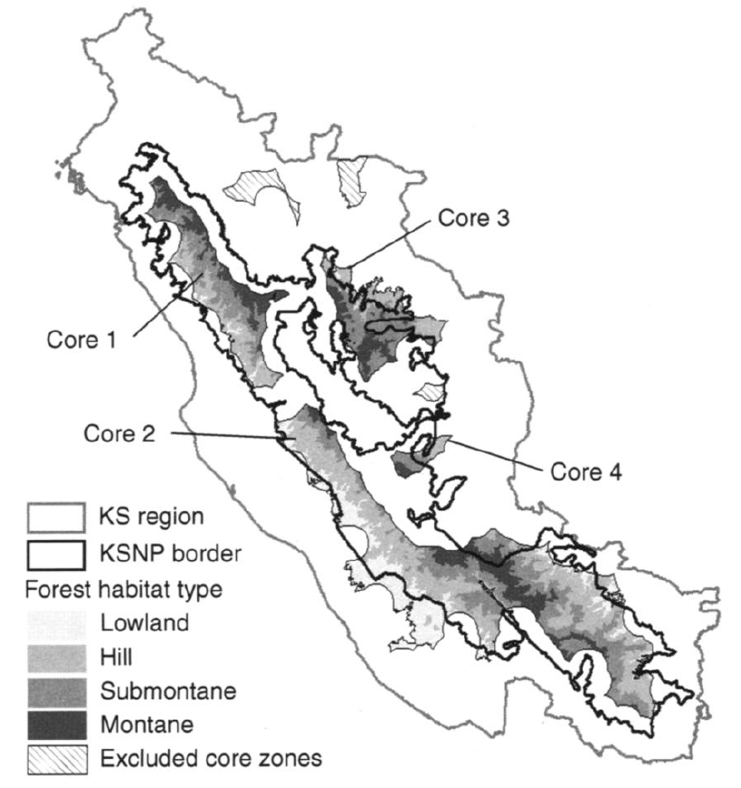

# Conservation of small populations {#chap:conservation}

There are three broad categories of goals for population management: harvesting, control, and conservation. This chapter focuses on the third one, conservation of small populations. As before, I want to be able to evaluate management alternatives intended to increase population size with the intent of being efficient about achieving conservation objectives. All the tools developed to this point are still relevant. The biggest difference between conservation and other management goals is that the populations are often very small. This means that in addition to deterministic effects on the life history, there is a much greater need to pay attention to stochastic effects. When there are fewer than 100 individuals in a population, a run of bad luck over a few years can dramatically reduce the size of the population. 

Populations can be extirpated in one of two ways. As mentioned above, **a population that has reached small numbers has a substantial risk of extinction even if the average growth rate of the population is positive, just due to stochastic effects.** This is called *stochastic extinction*. Marc Mangel and Charles Tier pointed this out in their paper "Four facts every conservation biologist should know" (Mangel and Tier 1994). Some authors have described concerns about stochasticity as the "small population paradigm". At least one scientist described this paradigm as "worrying about the rivets in the wing when the plane is already falling out the sky." The second way a population can go extinct is deterministically. **That is, the life history of the population is such that the average growth rate is negative. Such a population decays exponentially towards zero. This type of extinction is sometimes called a *driven extinction*.** These two categories are not exclusive. **A population undergoing a driven extinction also suffers from the effects of stochasticity as it becomes small.** 

```{block2, type='rmdnote', echo=TRUE}
### Mangel and Tier's Four Facts {-}

The starting point for Mangel and Tier's facts is a simple population model first presented by Robert MacArthur and Edward Wilson in their classic 1967 book Island Biogeography. 

1. A population can grow, on average, exponentially and without bound and still not persist.

2. There is a simple and direct method to compute persistence times that virtually all biologists can use.

3. The shoulder of the Macarthur-Wilson model occurs with other models but disappears when catastrophes are included.

4. Extinction times are approximately exponentially distributed and this means extinctions are likely.

```

## Minimum viable population size

In 1981 Mark Shaffer proposed a "rule of thumb" for the persistence of a population called the Minimum Viable Population Size (MVP). His definition of an MVP was

> A minimum viable population for any given species in any given habitat is the smallest isolated population having a 99\% chance of remaining extant for 1000 years despite the foreseeable effects of demographic, environmental, and genetic stochasticity, and natural catastrophes.

That definition sounds fine, but it doesn't describe how to actually calculate what the MVP size would be. In Chapter \@ref(chap:regulation) I discussed some of the effects of demographic and environmental stochasticity, as well as the effects of natural catastrophes. What about genetic stochasticity? Ian Franklin (1980) suggested that the *effective population size* needed to be $>50$ to avoid immediate inbreeding effects, and $>500$ to prevent serious loss of genetic variation. These numbers have become entrenched in the conciousness of generations of biologists, but where do they come from? 

The primary issue with the genetics of small populations has to do with *genetic drift*, which is

> variation in the relative frequency of different genotypes in a small population, owing to the chance disappearance of particular genes as individuals die or do not reproduce. (Google!)

Genetic drift can lead to the loss of an allele at a particular locus; this leads to a reduction in genetic variation at the locus. **This type of loss is more likely when populations are small, and when sex ratios (ratio of males to females) depart from the ideal for a population.** Thus genetic drift decreases with increasing population size, and decreases as a population gets closer to the ideal sex ratio.

Population geneticists measure genetic variation with a number called Heterozygosity ($H$). Heterozygosity is the proportion of genetic loci in a population that have more than one allele. If all loci are fixed at a single allele, then there is no genetic variation in a population, and no possibility for natural selection to generate changes. The observed heterozygosity $H_o$ at a target locus in a population of $n$ individuals is given by 

\begin{equation}
H_o = \frac{\sum_{i=1}^{n}{1 \,\text{if}\, a_{i1} \neq a_{i2}}}{n}
\end{equation}

where $a_{ij}$ is the allele on the $j^{th}$ chromosome of the $i^{th}$ individual. In an ideal population it is possible to calculate the expected heterozygosity given the frequencies of the alleles at the target locus is

\begin{equation}
H_e = 1 - \sum_{i=1}^{m}{\left(f_i\right)^2}
\end{equation}

where there are $m$ alleles at the target locus, and $f_i$ is the relative frequency of each allele. An ideal population is infinite in size, equal in sex ratio and panmictic (everyone has an equal chance of mating with everyone else). Obviously real populations are not ideal, and therefore $H_o < H_e$. Worse, if a population is a long ways from ideal, it is possible to lose heterozygosity over time just due to chance effects. This is the concern with genetic stochasticity. 

One way to quantify the departure of a real population from the ideal population is to calculate the *effective population size*. **This is an imaginary population with a perfect sex ratio that looses heterozygosity at the same rate as the observed population.** This calculation takes into account differences in the contribution of males and females to subsequent generations. It is the harmonic mean of the number of male and female individuals, and as such it is reduced if the sex ratio departs from an ideal of 50:50 (Figure \@ref(fig:Ne)A). The effective population size is given by

\begin{equation*}
N_e = \frac{4}{\frac{1}{N_f} + \frac{1}{N_m}}\,.
\end{equation*}

```{r Ne,echo=FALSE,fig.cap='**A** Effective population size as a fraction of actual population size for different proportions of males in the population. **B** Change in Heterozygosity as a function of total population size for $p_m = 0.5$ (solid line), an ideal population, and $p_m = 0.3$ (dashed line).'}
par(mfrow=c(1,2),pty="s")
N = 10000
Pm = seq(0,1,0.01)
Nm = N*Pm
Nf = N*(1-Pm)
Ne = 4 / (1/Nm + 1/Nf)
plot(Pm,Ne/N,type="l",lwd=3,xlab="Proportion of males",ylab="Effective Population Size / Total Population Size")
abline(h=1,lty=2)
N = seq(10,500,10)
Pm = 0.5
Nm = N*Pm
Nf = N*(1-Pm)
Ne = 4 / (1/Nm + 1/Nf)
DH = 1-1/(2*Ne)
text(0.05,0.95,"A",cex=2)
plot(N,DH,type="l",lwd=3,xlab="Total Population Size",ylab="Annual change in Heterozygosity")
Pm = 0.3
Nm = N*Pm
Nf = N*(1-Pm)
Ne = 4 / (1/Nm + 1/Nf)
DH = 1-1/(2*Ne)
lines(N,DH,type="l",lwd=3,lty=2)
text(15,0.995,"B",cex=2)
```

The relationship between effective population size and loss of heterozygosity is fairly simple. The expected annual change in heterozygosity is 

\begin{equation}
\frac{H_{t+1}}{H_t} = \Delta H = 1 - \frac{1}{2N_e}\,.
\end{equation}

So as effective population size increases, the expected ratio of $H_{t+1}$ to $H_t$ approaches 1 (Figure \@ref(fig:Ne)B). With this equation I can work out what levels of loss Franklin considered "acceptable". $N_e = 50$ implies $\Delta H = 0.99$, while $N_e = 500$ implies $\Delta H = 0.999$. Thus the common rules of thumb imply that rates of heterozygosity loss should not exceed 1% per year or 0.1% per year for long term persistence. It is clear why $N_e > 50$ seems like a good rule of thumb. At smaller population sizes the rate of Heterozygosity loss increases rapidly. However, even at an effective population size of 10 the loss rate is only 5% per year. When the population is that small there are much bigger concerns to worry about! The other thing to notice in Figure \@ref(fig:Ne)A is that skewing the sex ratio down to 30% males hardly moves the curve at all. That is a large departure in sex ratio, which suggests that it might not be that big of a concern at all. All of these calculations also assume that the ideal sex ratio is 50:50, which isn't the case for species with mating systems other than purely monogamous. 

The primary reason to be concerned about a loss of heterozygosity is the potential for "inbreeding depression". Every species has some alleles for many loci that are either non-functional or outright deadly. Mostly these alleles remain infrequent in a population, because whenever they are expressed they reduce survival, fecundity or both, and thus are strongly selected against. However, if a deleterious allele is recessive, it can persist in a population despite the selection, because it only causes problems when an individual is unlucky enough to get two copies of the allele. In a large population that is unlikely. However as populations shrink, or as heterozygosity decreases, the probability of expressing these deleterious alleles goes up. In very small populations matings between related individuals increases in frequency, and that increases the rate of expression still more. **A population experiencing a long term decline begins to lose heterozygosity at an ever greater rate, and inbreeding increases, leading to declines in fertility and survival, which further accelerates the rate of population decline. This positive feedback process has been dubbed an "extinction vortex"**. 

The only instance I am aware of where genetic concerns rose to the level of taking action directly is for the Florida Panther, an endangered subspecies of cougars (*Felis concolor*). This population occurs in extreme southern Florida, reduced to an area less than 5% of its pre-European range. In the early 1990's biologists studying the population concluded that inbreeding depression was responsible for reduced fertility of the remaining females. By 1995 the population was reduced to an estimated 20-30 individuals, well within the range of rapid loss of heterozygosity. In 1995 8 female cougars from a closely related population in Texas were released in southern Florida. The hope was that an injection of genetic diversity from these females would improve reproductive success, and reverse the extinction vortex that the population had fallen into. By 2003 the population had approximately tripled to over 80 animals, and the remaining three texas lions were captured and removed from the population. Without alot more work it will be hard to tell whether the increase was due to increased genetic diversity, demographic good luck, or both. Ultimately the population is sharply limited by the available habitat, which remains under extreme pressure from development and increasing human population growth in southern Florida.

## Extinction risk and expected minimum population size

When I introduced the concepts of demographic and environmental stochasticity in Chapter \@ref(chap:regulation) I focused on projecting the mean and variance of a population into the future. As time passes, the variance of a population subject to stochasticity also increases. This is why a population that grows on average can still decline --- part of the distribution in the future is less than the starting population size. From a conservation standpoint the part of the distribution I worry about the most is the extreme tail. What is the probability that a population starting out at $N_0$ will go extinct? This is exactly what is needed to calculate the MVP defined by Shaffer. A 99% chance of remaining extant is a 1\% chance of going extinct. 

If I ignore catastrophes and genetic stochasticity I can use the same model in \@ref(eq:demoStochExp) and \@ref(eq:demoStochVar) to work out what the probability of a population not going extinct, ever. If $d > b$ that probability is zero. **That is, if average death rates exceed average birth rates the population *will* go extinct.** However, if $d < b$ and the population is not limited by a carrying capacity, then there is a probability that it will persist and that is given by

\begin{equation}
p\left\{Persistence | N_0\right\} = 1 - \left(\frac{d}{b}\right)^{N_0}\,.
(\#eq:extinction)
\end{equation}

The term $\frac{d}{b}$ is less than 1 by definition, so as the population size increases this probability gets closer and closer to 1 (Figure \@ref(fig:PBD)). In fact for very reasonable values of $b$ and $d$ the probability rapidly approaches 1. From this perspective 50 would seem to be a very reasonable MVP. There are a couple of reasons why these curves are too optimistic. These formulas treat population size as continuous (that is, $N_0 = 1.2745$ is reasonable), but populations are made up of individuals. Having discrete individuals creates "lattice effects", which are very similar to the effects of demographic stochasticity. But far worse the is the consequence of ignoring catastrophes.  

```{r PBD,echo=FALSE,fig.cap='Probability of persistence as a function of initial population size. Solid line - $b = 0.4$ and $d = 0.1$. Dashed line - Catastrophes added on average every 20 years killing an average of 55 individuals.'}
par(mfrow=c(1,2),pty="s")
b=0.4
d=0.1
N0 = 1:50
PP = 1 - (d/b)^N0
plot(N0,PP,type="l",lwd=3, ylim=c(0,1), xlab="Initial population size",ylab="Probability of persistence")
c=0.05
Ybar = 4
Z0 = log(N0)
r = b-d
PP = 1 - (c/r)*Ybar*exp(-(1/Ybar - c/r)*Z0)
lines(N0,PP,lty=2,lwd=3)
# expand the x axis
b=0.4
d=0.1
N0 = seq(10,500,10)
PP = 1 - (d/b)^N0
plot(N0,PP,type="l",lwd=3, ylim=c(0,1), xlab="Initial population size",ylab="Probability of persistence")
c=0.05
Ybar = 4
Z0 = log(N0)
r = b-d
PP = 1 - (c/r)*Ybar*exp(-(1/Ybar - c/r)*Z0)
lines(N0,PP,lty=2,lwd=3)

```

Catastrophic events are characterized by two things: the frequency they occur at and the distribution of the number of individuals killed. The northern bobwhite data in Figure \@ref(fig:bobwhites) provided an example of a catastrophe that occured in 1983. Diseases can also cause catastrophic mortality. Although the true magnitude of the event will likely never be known, the outbreak of Epizootic Hemorrhagic Disease in deer in 2012 was much larger than any observed in past years in Nebraska and neighbouring states. Mangel and Tier (1994) presented theoretical results that showed including catastrophes dramatically reduced the probability of persistence (Dashed line in Figure \@ref(fig:PBD)). Moreover even much larger populations still have substantial probabilities of going extinct. Similarly, including an upper limit on population size also reduces the probability of persistence. 

These theoretical results are nice, but only work for very simple population models. Adding complexities like age structure and 2 sexes make the the computations unmanageable. Although Mangel and Tier claimed their method could be used "...by virtually all biologists." as far as I know it never has been used! It is always possible to construct computer simulations that approximate these probabilities over some fixed period of time. These simulations, often called "Population Viability Analyses" (PVA), have the advantage that as much biological complexity can be included as there is data to support. The disadvantage is that the output is also difficult to summarize effectively. Each different set of life history parameters generates a distribution of population sizes at some future point (Figure \@ref(fig:quasiextinction1)). The red line in the right hand panel assumes $r_{max}$ is larger, so the extinction risk is reduced. **A management option that has a cumulative frequency curve farther to the right has a lower risk of extinction.**

One way to summarize these distributions is to select a particular population size, and then calculate the probability that the simulated population will fall below that level. This critical value is known as a "quasi-extinction threshold". One side benefit of this approach is that potential (and typically unknown) effects of inbreeding depression can be avoided by selecting a value for quasi-extinction that is above the population size where these effects become large. This is essentially selecting a point on the x-axis of Figure \@ref(fig:quasiextinction1)B, and reading off the proportion of replicate runs that fall below that point. While this gives us a single number to work with, the choice of which value of the population size to designate as "critical" is subjective, and so it is easy to skew results one way or the other by making different choices. If you want a high probability of quasi-extinction select a high value and/or a long time period. If you want a low probability select a low value and/or a short time period. Although Mark Shaffer's original definition of an MVP used a threshold of 99\% persistence over 1000 years, there is in fact little or no standardization of these values.

```{r quasiextinction1,echo=FALSE,cache=TRUE,fig.cap='Quasiextinction risk at 50 years for a logistic model of discrete individuals with demographic stochasticity. Left hand panel has one line for each replicate to show the distribution of outcomes. Points on each line indicate the smallest population size for each replicate. Parameters for the logistic equation are K = 150, r = 0.05. Right hand panel shows the cumulative distribution of population size at t = 50. Black line: distribution from right hand panel.  Red line: K = 150, r = 0.1.'}
b = function(N,a=0.5,b=-0.0005){a + b*N}
d = function(N){0.45 + 0*N}
N0 = 30
sim = function(N0,bfunc,dfunc,T=50, ...){
  N = vector("numeric",length=T)
  N[1] = N0
  for (t in 2:T){
    N[t] = N[t-1]+rbinom(1,N[t-1],bfunc(N[t-1], ...))-rbinom(1,N[t-1],dfunc(N[t-1]))
  }
  return(N)
}
N = matrix(NA,nrow=1000,ncol=50)
for (i in 1:1000){
  N[i,] = sim(N0,b,d)
}

library(grid)
library(ggplot2)
library(reshape2)
grid.newpage()
pushViewport(viewport(layout=grid.layout(1, 2),h=0.5,name="A"))
pushViewport(viewport(layout.pos.col=1,name="leftside"))
upViewport()
pushViewport(viewport(layout.pos.col=2,name="rightside"))
N = data.frame(t=1:50,t(N))
longN = melt(N,id.vars="t")
# now add points at the minimum for each replicate
mins <- apply(N[,2:1001],2,min)
when.min <- apply(N[,2:1001],2,which.min)
min.df = data.frame(t = when.min,minN = mins)

zp1 <- ggplot(NULL) + 
  geom_line(data=longN,alpha = I(1/sqrt(1000)),size=I(2),aes(x=t,y=value, group=variable)) + 
  theme_classic() + 
  geom_point(aes(x=t,y=minN),data=min.df)
zp1 <- zp1 + scale_x_continuous("Time [years]", expand = c(0, 0))
zp1 <- zp1 + scale_y_continuous("Population Size", expand = c(0, 0), limits=c(0,max(N)))
zp1 <- zp1 + annotate("text", x=5, y=125, label = "A", size=5)

print(zp1,vp="leftside")

df <- data.frame(X1=unlist(N[50,2:1000]))

N = matrix(NA,nrow=1000,ncol=50)
for (i in 1:1000){
  N[i,] = sim(N0,b,d,a=0.55)
}
df <- cbind(df,X2=unlist(N[2:1000,50]))
N = data.frame(t=1:50,t(N))
mins <- apply(N[,2:1001],2,min)
when.min <- apply(N[,2:1001],2,which.min)
min.df2 = data.frame(t = when.min,minN = mins)

zp2 <- ggplot(df, aes(X1)) + stat_ecdf()
zp2 <- zp2 + stat_ecdf(aes(X2,color="red"))  + scale_color_discrete(guide="none")
zp2 <- zp2 + theme_classic()
zp2 <- zp2 + scale_x_continuous("Population Size", expand = c(0, 0), limits=c(0,max(N)))
zp2 <- zp2 + scale_y_continuous("Cumulative Frequency", expand = c(0, 0), limits=c(0,1))
zp2 <- zp2 + annotate("text", x=30, y=.8, label = "B", size=5)
print(zp2,vp="rightside")


```

Another way to summarize the distribution in Figure \@ref(fig:quasiextinction1) that is less arbitrary involves calculating the **expected minimum population size** (McCarthy and Thompson 2006). This is easily calculated for any model. Simply record the smallest population size observed in each run of the model at any point in time (the dots in Figure \@ref(fig:quasiextinction1)A), and take the average of these values. The model run with $r_{max} = 0.05$ has an expected minimum population size of `r mean(min.df$minN)`. Increasing $r_{max}$ to 0.1 increases expected minimum population size to `r mean(min.df2$minN)`. This is better than the quasiextinction risk because a population can fall to a low value at any point in the time period, and can often be much lower in the middle of the trajectory than it is at the end. Such population minima represent points of increased risk of extinction whenever they occur. Mick McCarthy and Colin Thompson demonstrated that the **expected minimum population size is more sensitive to changes in life history parameters than the probability of extinction or quasiextinction, and this makes it a better metric to use when comparing management options.**

Although PVA models are increasingly common, they are not without critics. Stephen Beissinger and Michael Westphal [-@beissinger1998use] highlighted many of the pitfalls of using them. In particular they argued that estimation errors in model parameters rendered predictions of extinction risk problematic or even useless. It is true that variation in the parameters lead to errors, or perhaps better, variation in the predictions of a model. Despite that, models can still be useful, and in particular, it has been shown that **the relative predictions of a PVA model are quite robust to variation in the parameters** (McCarthy et al 2003). By relative prediction I mean the rank order of a series of alternative management choices. So if option A is better than option B, then it is almost always better regardless of estimation errors in the parameters. Empirical tests of PVA models in several different circumstances have shown that short term prediction of population size and distribution can be quite good. How well that performance translates into long term performance in the face of changing environments remains an open question.

## Dealing with habitat fragmentation

One key assumption I've made up to this point in the book is that populations are closed. That is, that there is a single area within which individuals can freely mix. However, one of the most dramatic effects of human development on the landscape is the fragmentation of natural habitats. With few exceptions, human modification of the landscape for human benefit results in isolated patches of natural habitat seperated by areas that are less suitable, or even completely unsuitable, for wildlife. Grazing livestock on rangelands is one of the exceptions. That this fragmentation has consequences for populations was recognized long ago, but it wasn't until the late 1960's that theoretical models emerged to predict the effects. 

Robert MacArthur and Edward Wilson created Island Biogeography theory to explain variation in the number of species found on islands, but early conservation biologists were quick to apply the same ideas to "islands" of habitat in a sea of agriculture. The analogy was crude, and often did not work well. In part this was because Island Biogeography was meant to apply to evolutionary timescales, and conservation biologists were working on recently isolated habitat patches. In addition, conservation biologists were often concerned with single species rather than the ecological communities predicted by Island Biogeography. Two important concepts were highlighted however. **First, that the probability of extinction of a species decreases with the area of the island. Second, that the isolation of an island predicts the probability that a species will colonize it.** Islands that are farther away from a mainland or other islands will have a lower probability of being reached by dispersing individuals. 

At about the same time, Richard Levins published a couple of papers describing what he called a "metapopulation" --- a population of populations. In the simplest version of the model, each subpopulation in the metapopulation is either occupied by a species or unoccupied. All subpopulations are assumed to be the same size and equally distant from each other. In that case, occupied subpopulations become unoccupied when local extinction occurs at a rate $e\cdot P$, where $P$ is the proportion of subpopulations that are occupied. The rate constant $e$ is multiplied by the proportion of occupied subpopulations because only these populations can go extinct. Unoccupied subpopulations become occupied when dispersers from other occupied subpopulations reach them and successfully colonize. This occurs at a rate $c\cdot P\left(1-P\right)$. Putting these two processes together I get the Levins metapopulation model for change in the proportion of occupied subpopulations

\begin{equation}
\frac{dP}{dt} = cP\left(1-P\right) - eP
(\#eq:levins)
\end{equation}

As with population models, I want to identify the equilibrium points in this model that occur when the rate of change is zero. When $P=1$ the only thing that can happen is extinction, the rate of change is necessarily less than zero (unless $e=0$) and so that is not an equilibrium point. If I set \@ref(eq:levins) equal to zero and solve for $P$ I get

\begin{equation}
P^* = 1 - \frac{e}{c}
\end{equation}

which says that the equilibrium proportion of occupied habitats is greater than zero as long as $e>c$, because then $\frac{e}{c} < 1$. **An increase in the rate of local extinctions decreases the proportion of occupied patches, and an increase in the colonization rate increases the proportion.** Notice the similarity between these conclusions and the conclusions about the extinction from a single population from \@ref(eq:extinction). When $P=0$, $dp/dt = 0$ because both colonization and extinction terms are zero. Although this is an equilibrium point, it is not stable because even a small increase in P will lead to a further increase unless $e>c$. That is, if the colonization rate is greater than the extinction rate the proportion of occupied subpopulations will increase.

This is a very simple model, and the assumptions are obviously over simplified. However, the model makes one very profound and important prediction for fragmented habitats. **Even when everything is going well, the proportion of habitat patches that are occupied by a species is less than one.** That is, some otherwise suitable habitat will not be used. This is a very common observation in nature, and the Levins model suggests that it should not be a surprising one. 

The Levins model and Island Biogeography laid the foundations of modern metapopulation theory. The essential elements of all PVA models of species in fragmented habitats revolve around the ideas of the effects of area on extinction, the effects of isolation on colonization and extinction, and the central importance of patch occupancy. Metapopulation models range from simple to extremely complex. In the following sections I will describe two models that have been applied to addressing simple management questions. 

### Sumatran tiger management

The Sumatran subspecies of tiger (*Pantheris tigris sumatrae*) is classified as critically endangered by the IUCN. There are only 4 extant subpopulations in the region of the Kerinci Seblat National Park, Sumatra (Figure \@ref(fig:tigermap)). Linkie et al [-@linkie2006assessing] studied these populations and used a PVA model to calculate the probability of extinction of each in the absence of management over 50 years (a do nothing option), as well as the change in extinction probability for different levels of investment. For the most part the investments represent anti-poaching patrols to prevent illegal harvest of tigers in and around the park. The problem that must be solved is how to allocate poaching patrols among the 4 subpopulations. Should they all be patrolled equally? Put all the eggs in one basket? Allocate effort in proportion to population size? 

```{r tigermap, fig.cap="Core tiger habitat in the Kerinci Seblat region of Sumatra, with the four different habitat types. Adapted from Linkie et al 2006."}

```

Chauvenet et al. [-@chauvenet2010optimal] formulated this as a decision theory problem. Using the PrOACT terminology from Chapter \@ref(chap:sdm), the *Problem* was stated above: allocate a fixed number of poaching patrols among the 4 subpopulations. The *Objective* that they chose was to minimize the probability that one or more of the subpopulations would go extinct. In the absence of management this is given by 

\begin{equation}
Pr\left\{\text{one or more subpopulations extinct}\right\} = 
1 - \prod_{i=1}^{4}{\left(1-P_{0i}\right)}
(\#eq:objtiger)
\end{equation}

where $P_{0i}$ is the probability of the $i^{th}$ population going extinct without management over a 50 year period. \@ref(eq:objtiger) starts with the probability that a subpopulation does not go extinct, $1-P_{0i}$. The probabilty that none of the subpopulations go extinct is simply the product of the four individual subpopulations not going extinct. This assumes that whether or not one of the subpopulations goes extinct is an event that is independent of whether or not the others do. Finally, by the law of total probability (the probability of all events has to add up to one), the probability of one or more subpopulations going extinct is just one minus the probability of none of the populations going extinct. They only had a single objective because they use the total budget available as a constraint on the range of options they could look at. 

Having set the objective, the next step is to consider the *alternatives*. As it happens, Core area 2, the largest of the four (see Figure \@ref(fig:tigermap)), has a zero probability of extinction regardless of the degree of poaching. However Linkie et al. only evaluated poaching up to 5 tigers per year, so if poaching was in fact higher then this conclusion wouldn't hold. However, removing 5 tigers per year from each of the smaller subpopulations leads to a 50 year extinction probability approaching 1. So Chauvenet et al. considered options that divide the anti-poaching budget up between subpopulations 1, 3 and 4. Implementing anti-poaching patrols in an area requires some constant fixed cost regardless of the effort involved, and then some variable cost per unit of effort. So for a total budget $b$ the amount of anti-poaching patrol effort for an area $i$ is

\begin{equation*}
A_i = \frac{\alpha_i b - c_f}{c_v}
\end{equation*}

where $\alpha_i$ is the proportion of the total budget devoted to area $i$, $c_f$ is the fixed cost, and $c_v$ is the variable cost. Note that $\sum_{i=1}^{4}\alpha_i = 1$, and $\alpha_2 = 0$. Chauvenet et al. built a sophisticated dynamic optimization model to get the exact answer, but I'll just evaluate some obvious alternatives here (Table \@ref(tab:tigeralts)).

```{r tigeralts}
ta <- readr::read_delim(
"Alternative & Values
 Split budget equally & $\\alpha_i = 0.33$ 
Split budget in proportion to extinction risk & $\\alpha_1 = \\alpha_3 = 0.23$, $\\alpha_4 = 0.54$ 
  Put the whole budget in 4 & $\\alpha_1 = \\alpha_3 = 0$, $\\alpha_4 = 1.0$", delim="&")
knitr::kable(ta, caption="Alternative budget allocation rules. Recall that $\\alpha_2 = 0$ always.")
```

The next step in the process is to calculate the *consequences* of different alternatives. This requires us to connect the effort in an area to a reduction in the extinction probability. Chauvenet et al. choose a simple model

\begin{equation}
Pr\left\{\text{area i extinct}|\alpha_i b\right\} = \frac{P_{0i}}
                                                         {\phi_i \frac{\alpha_i b - c_f}{c_v}+1}
\end{equation}

where $\phi_i$ is a coefficient that describes how effective anti-poaching effort is at reducing the extinction risk in area $i$. Chauvenet et al. estimated these coefficients for each area from the results presented in Linkie et al. When $\alpha_i = 0$ then the extinction probability for area $i$ is just $P_{0i}$. As poaching effort increases, the extinction probability decreases hyperbolically towards zero. This means that initially small levels of effort make a big difference, but the gain per unit effort decreases as effort increases. This function gives me the actual probability of extinction for each area, which I then use in \@ref(eq:objtiger) to calculate the probability that one or more areas go extinct over 50 years (Table \@ref(tab:tigerconsequences)). Splitting the budget equally or according to the extinction risk in each area give nearly identical results, about 3 times better than doing nothing. These rules are very close to the performance obtained with the full dynamic optimization model. Putting all the effort into the most at risk population gives a substantially worse performance. Even so, with the particular budget available the expected time to the first extinction is still only about 10 years for the best options (1/Pr(1 or more extinct)). There is only one objective so there is no need to consider tradeoffs among competing objectives. 

```{r tigereffort,echo=FALSE,fig.cap="Extinction probability as a function of budget for areas 4 (solid line) and 1 (dashed line). Parameters given in Table \\@ref(tab:tigerparameters)."}
P0 = c(0.088,0,0.088,0.205)
phi = c(0.046,0,0.016,0.06)
b = 52704
cf = 1728
cv = 220
alpha = seq(cf/b,1,0.01)
Pfunc = function(alpha,P0=0.8,phi=0.05,b=50000,cf=2000,cv=220){
  # trial doesn't work if alpha = 0 for an option with P0 > 0
  trial = P0/(phi*((alpha*b-cf)/cv)+1) 
  trial[alpha==0] = P0[alpha==0]
  return(trial)
}
plot(alpha*b-cf,Pfunc(alpha,P0[4],phi[4],b,cf,cv),type="l",ylim=c(0,max(P0)),
     xlab="Allocated $ above fixed cost",xaxs="i",
     ylab="50 year extinction probability",yaxs="i",
     lwd=3,bty="l")
lines(alpha*b-cf,Pfunc(alpha,P0[1],phi[1],b,cf,cv),lty=2,lwd=3)
```

```{r tigerparameters}
tp <- readr::read_delim(
"Parameter & Symbol   & Value
Unmanaged probability of extinction & $P_{0i}$ &  
  1 &  & 0.088 
  2 &  & 0.00  
  3 &  & 0.088 
  4 &  & 0.205 
Management efficiency & $\\phi_i$ & 
 1 &  & 0.046 
 2 &  & 0.00  
 3 &  & 0.016 
 4 &  & 0.06 
Total budget & $b$ & 52704 
Fixed costs of managing subpopulation & $c_f$ & 1728 
Variable cost of management action (per unit effort) & $c_v$ & 220 ", delim="&")
knitr::kable(tp, caption="Parameters of the model from Chauvenet et al 2010. All costs in US$.")
```


```{r tigerconsequences,echo=FALSE}
alpha = c(1/3,0,1/3,1/3)
p1 = Pfunc(alpha,P0,phi,b,cf,cv)
p1 = 1-prod(1-p1)
alpha = c(0.23,0,0.23,0.54)
p2 = Pfunc(alpha,P0,phi,b,cf,cv)
p2 = 1-prod(1-p2)
alpha = c(0,0,0,1)
p3 = Pfunc(alpha,P0,phi,b,cf,cv)
p3 = 1-prod(1-p3)
tc <- data.frame(Alternative=c("Do Nothing",ta$Alternative),
                 Values=c(
                   format(1-prod(1-P0), digits=2),
                   format(p1,digits=2),
                   format(p2,digits=2),
                   format(p3,digits=2)
                 ))
knitr::kable(tc, caption="Consequences of alternative budget allocation rules.")
```

