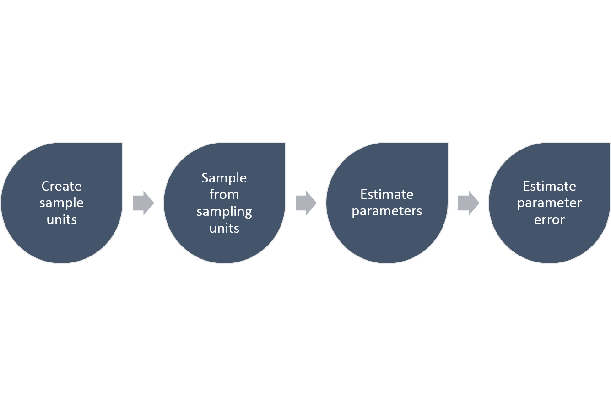

--- 
title: "Lecture Notes for Biology of Wildlife Populations"
author: "Andrew Tyre"
date: "2018-12-26"
site: bookdown::bookdown_site
output: bookdown::gitbook
documentclass: book
bibliography: [book.bib, packages.bib]
biblio-style: apalike
link-citations: yes
github-repo: atyre2/NRES450_book
description: "These are the lecture notes for NRES 450 Biology of Wildlife populations at the University of Nebraska."
---

# Preface {-}

Placeholder


<!--chapter:end:index.Rmd-->


# The fundamental law of population dynamics {#chap:fundamental}

Placeholder


## Learning objectives
## Introduction
### Killer whales and sea otters
## The laws of nature
## The nature of models of nature
## Glossary

<!--chapter:end:01-fundamental-law.Rmd-->


# Making decisions {#chap:sdm}

Placeholder


## Learning objectives
## Problem
## Objectives
## Alternatives
## Consequences
## Tradeoffs
## Exercises
### Wild horses in the American Southwest {-}

<!--chapter:end:02-sdm.Rmd-->

# Estimating Abundance {#chap:abundance}


```r
knitr::read_chunk("R/ci_coverage.r")
```

## Learning objectives
At the end of chapter 3, the student should be able to: 

General objective: 
1. Estimate the abundance of a species within a specific geographical area, and critically evaluate the utility of abundance estimates.

Chapter objectives: 
1. Estimate population parameters: population size, density.
2. Estimate the uncertainty of a population estimate in various ways, and the factors that affect the precision of this uncertainty. 
3. Assess tradeoffs between the accuracy of the information collected and the objectives proposed in a management scenario. 


The fundamental metric of population dynamics is the abundance of the population. Entire books, indeed lifetimes of research, have been devoted to this topic. Here I do not attempt a complete coverage of the topic, but merely introduce the most basic approach – counting organisms in a sample of areas of known size. We will learn how to calculate the uncertainty in an estimate of abundance, and how that uncertainty changes with effort devoted to sampling. This is an important concept for a manager of wildlife, because it is necessary to figure out how much information is good enough for the purpose at hand. More accurate information is certainly "better" in some abstract sense, but when that accuracy comes at a cost in resources, a tradeoff (in the very specific sense of chapter \@ref(chap:sdm)) must be made between the accuracy of the information and other objectives to which those resources could be bent. 

Why bother to estimate the size of the population? Why not simply count every individual animal, and obtain a *census* of the population? This was standard practice for large mammals in North America until the middle of the 20^th^ century, and even later in Africa. With enough well trained personnel, it is indeed possible to obtain high levels of complete counts for populations, particularly in open areas like the African savannah. **The primary reason for abandoning complete counts is cost.** The time required to survey every piece of a landscape or region is tremendous, and time is money. In addition, for many species in many landscapes, the assumption of complete detectability, that every individual in a sample unit is counted, is not met. In that case, the attempt to census the population leads to an abundance that is biased (more on this later). We can both reduce costs and deal with bias of incomplete detectability by moving to statistical sampling procedures for estimating the total abundance of a population in a given area. 

The steps required to estimate any parameter in a population, like the total abundance, follows this general scheme


```r

```

\begin{figure}
\includegraphics[width=0.49\linewidth]{images/Sampling_Design} \caption{The general steps required to do a simple random sampling.}(\#fig:scheme)
\end{figure}

## Sampling error, accuracy and precision

When we want to measure $N$, the abundance of a population in a particular area, we have two choices: census or sample. A census means that every individual is counted – no one is missed, no one is counted twice, the answer is $N$, exactly. In that case, we know what $N$ is, and there is no error to estimate. In this case, "error" has a very specific meaning. The error is the difference between the true $N$ and the $N$ that we have measured. In reality, the error is never zero. Even if a survey of abundance is called a census, it is virtually impossible to have an exact count of a real population. At best the error in the count is small and ignorable. A much better approach is to recognize the existence of error in our counts, and quantify it. From now on, to distinguish between the true population abundance, $N$, and our estimate of the abundance, I will use a "hat" to indicate the estimated abundance, like this: $\hat{N}$.

Error in an estimated quantity like the abundance has two components, the precision and the accuracy. Precision refers to the variation between repeated estimates of the same type -- if we sampled the same population repeatedly, what is the average difference between repeated samples (Figure \@ref(fig:precision))? In contrast, accuracy refers to the distance between the average estimate and the truth. A good estimate will on average have no deviation from the true population abundance. Any individual estimate will be off by some unknown amount, but averaging repeated samples would converge to the true value. An estimate of a quantity that has a non-zero average difference between the estimate and the true value of the quantity is said to be biased. We want unbiased estimates of abundance. 


```r
knitr::include_graphics(c("images/High_precision_Low_accuracy.png", "images/High_accuracy_Low_precision.png"))
```

\begin{figure}
\includegraphics[width=0.49\linewidth]{images/High_precision_Low_accuracy} \includegraphics[width=0.49\linewidth]{images/High_accuracy_Low_precision} \caption{The classic depiction of the difference between accuracy and precision. The figure on the left shows high precision but low accuracy, while the figure on the right shows high accuracy and low precision. (Images from Wikimedia Commons, in the public domain)}(\#fig:precision)
\end{figure}

## Simple random sampling

We'll begin with the easiest possible estimate of abundance. We have some area, $A$, which we call the *sample frame*. We divide the sample frame into $U$ equal sized areas. We’ll call these subdivisions of the area sample units. The area of each sample unit is $a$, and $Ua=A$. We assume that we can count all the individuals in a sample unit without missing any individuals (perfect detection), and without counting individuals more than once (no double counting). We cannot count all $U$ sample units. If we could, we would have a census, not a sample. Instead, we will select $u$ sample units, where typically $u$ is much smaller than $U$. We will select the sample units at random. 

There are two ways to sample randomly from the set of all sample units. Give each sample unit a unique number, and place strips of paper with each number into a bag. In the first method, sampling with replacement, we draw a strip of paper, note the number, and then put the strip of paper back into the bag. **This means that it is possible for a given sample unit to be counted more than once.** In the second method, sampling without replacement, we draw a strip of paper, note the number, and then set that strip of paper aside. This means that each sample unit will only be sampled once. Both methods give the same result for the estimated abundance, but the precision of the samples will be different, especially if the total number of sample units U is small. Either way, we have now obtained a list of sample units in which to count our individuals. 

Having established which units to sample, we now obtain our counts which I'll label $y_i$ for the number of individuals counted in sample unit $i$. From this dataset I can obtain the point estimate for the abundance in two steps. First, I calculate the average, or expected value, of the density for each unit $\hat{D}$. Second, I multiply this estimated average by the total area of the sample frame $A$ to obtain the estimated abundance. The expected value of $\hat{D}$ is given by

\begin{equation}
  \hat{D}=\frac{\sum_{i=1}^u{y_i}}{\sum_{i=1}^u{a_i}}
         =\frac{\sum_{i=1}^u{y_i}}{ua}
         =\bar{y}\frac{1}{a}
  (\#eq:densitySWR)
\end{equation}

which has units of individuals per unit area. If you look back into your introductory statistics textbook, this is simply the arithmetic mean ($\bar{y}$) multiplied by $1/a$. This is the conversion from an average count per sample unit to an average density per unit area. The estimated abundance in the entire area is then

\begin{equation}
  \hat{N}=\hat{D}A.
  (\#eq:abundance)
\end{equation}

**This estimate will be unbiased, or accurate, if our counts in each sample unit are made without errors. All individuals present are detected, no individuals are counted twice, and no other species are mistakenly identified as the species of interest.** These are challenging conditions to meet, in most cases. 

The next step is to quantify the precision of our estimate. This is the step that differs between sampling with and without replacement. The simplest formula is for the case where sampling is done with replacement. This is the same formula for the standard error of a mean when sampling from an infinite population. The first step is to calculate the sample variance of the counts

$$
s_y^2 = \frac{\sum_{i=1}^{u}{y_i^2}-\frac{\left(\sum_{i=1}^u{y_i}\right)^2}{u}}
               {u-1}
  (\#eq:samplevariance)
$$

This is the variance of the distribution of the counts, not yet the precision of our sample mean. The sample variance is a property of the observed counts. In contrast, the precision of our sample mean is a property of a statistic, the average density. This statistic itself has a distribution, that is, it is a random variable whose value is not known precisely. Imagine taking a second, and then a third, sample of units and recalculating the average density. Each time you take a sample, the average density will be different. Imagine doing that infinitely many times, and you have the distribution of the average density.

The best estimate of the expected value of the distribution of the average density is just the sample mean. But what about the variance of the distribution of the average density? The sample variance seems relevant; a more variable sample should lead to a less precise estimate of the sample mean. Intuitively, as more data are collected, the precision should improve the estimate of the mean gets better. So the variance of our average density should increase with the sample variance and decrease with the sample size, and it turns out that

\begin{equation}
  s_{\hat{D}}^2 = \frac{1}{a^2}\frac{s_y^2}{u}
  (\#eq:densityvarwr)
\end{equation}

is an unbiased estimate of the variance of the density. The square root of this variance $s_{\hat{D}}$  is given a special name, the standard error of the density. The term with $a^2$ in the denominator simply ensures that the correct units are maintained. 

What if the sample was taken without replacement? In this case the finiteness of the sample has to be taken into account. As the number of samples taken, $u$, increases towards the number of sample units available the sample becomes less of a sample and more of a census. In the extreme, sampling all of the units, the count is a census with no sampling variation at all. Thus the precision of our estimated mean should increase as the fraction of sample units counted increases. Equivalently, this means that the variance of the sample mean should decrease as the number of units counted rises towards the number available. The usual way to achieve this is to use the *finite population correction* in the formula for the variance of the sample mean

\begin{equation}
  s_{\hat{D}}^2 = \frac{1}{a^2}\frac{s_y^2}{u}\left(1-\frac{u}{U}\right)
  (\#eq:densityvarwor)
\end{equation}

And when $u = U$ this extra term equals zero, and the variance of the sample mean is zero. As a result of this correction factor, estimates from a sample without replacement are always more precise than a sample taken with replacement. 

The last step is to estimate the precision of the abundance $\hat{N}$. This quantity is a function of a random variable, $\hat{D}$, and a constant $A$. There are several different ways to justify this, but for now just accept that the variance of the product of a random variable and a constant is just the product of the variance and the constant squared. In words that doesn't sound so good, so here it is as a formula:

\begin{equation}
  s_{\hat{N}}^2= s_{\hat{D}}^2 A^2
  (\#eq:abundancevar)
\end{equation}

which is pretty easy. 

With the estimated abundance and it’s precision in hand, there are a couple of other numbers worth calculating. The coefficient of variation is simply

\begin{equation}
  CV_{\hat{N}} =\frac{s_{\hat{N}}}{\hat{N}}  100
  (\#eq:cv)
\end{equation}

or the ratio between the standard error of abundance and abundance multiplied by 100. The CV is a useful relative measure of precision that can be readily compared between different estimates. Imagine you have 2 estimates, one of 100 individuals with a standard error of 10 and the second of a 1000 individuals with a standard error of 50. Which estimate is more precise? In an absolute sense the first estimate has a smaller standard error. However, in a relative sense, the second one is more precise with a CV of 5% compared to a CV of 10%. Implicit in the use of the CV is that a deviation of a given size is less important if the abundance is larger. 

When presenting estimated abundances graphically or in tables it is standard practice to convert the estimates of the precision into confidence limits on the estimate. A confidence limit shows the range of values that would contain the true mean a certain percentage of the time, typically 95%, if the entire estimation process (including calculating the confidence limits) were repeated many times (Figure \@ref(fig:ciCoverage)). This is a challenging concept to grasp --- however there are a couple of simple rules for interpreting these limits. First, you may not infer that the distribution of possible population sizes is indicated by the confidence limits. Unfortunately this is exactly what most biologists would like to do. Second, smaller confidence intervals are better. Third, **if the confidence limits do not include some specific constant (like a target population size), then you can say that the estimate is statistically significantly different from the constant value.**

```r
# abundance CI coverage
# 
U = 100
u = 10
N = 100
n.true=rnorm(U,N/U)
#sum(n.true)
# sampling with replacement
sample.it <- function(x,n,U,u){
  n = sample(n,u,replace=TRUE)
  somevariable = x
  N.hat = mean(n)*U
  N.var = U^2*var(n)/u
  N.CI = c(N.hat-qt(0.975,9)*sqrt(N.var),N.hat+qt(0.975,9)*sqrt(N.var))
  return(c(N.hat,N.var,N.CI))
}

samples = sapply(1:20,sample.it,U=U,u=u,n=n.true)
plot(samples[1,],ylim=range(samples[3:4,]),pch=19,axes=FALSE,xlab="",ylab="Abundance")
box()
axis(2,at=seq(0,200,50))
arrows(1:20,samples[3,],1:20,samples[4,],angle=90,code=3,length=0.1)
abline(h=sum(n.true),lty=2)
```

 

## How big a sample to take?


```r
u <- 2:100
var <- D <- 10
SE <- sqrt(var/u)
CV <- SE/D
plot(SE~u,xlab="Sample size",ylab="Standard Error",type="l",lwd=3)
box()
D <- 10
var <- 20
SE <- sqrt(var/u)
CV <- SE/D
lines(SE~u,col="red")
D <- 10
var <- 5
SE <- sqrt(var/u)
CV <- SE/D
lines(SE~u,col="green")
```

 

Should we care how many units we sample? Each additional unit increases the cost of the effort - at a minimum it takes time, and time is usually money. So why not use the smallest number of units possible? We can calculate a variance with a sample size of two, so why not use only two? 

As always in life, there is a tradeoff to be made here. Fewer sample units are cheaper, but the resulting estimate is less precise. Unfortunately, there is no "rule of thumb" that works for all samples. The greater the sample size, the more precise the estimate is all one can say. The response is also not linear -- when sample sizes are small the increase in precision with each additional sample is greater than when sample sizes are large (Figure \@ref(fig:sampleSize)). The exact height of this curve depends on the variance of the counts in each sample unit, but the shape of the curve will always be a reciprocal function of the sample size. The curve is higher (worse precision for a given sample size) when the variance of the counts is higher for the same average count (red line in Figure \@ref(fig:sampleSize)). The curve is lower (better precision for a given sample size) when the variance is smaller (green line in Figure \@ref(fig:sampleSize)).

So how do we decide on the number of samples to take? We need to have some information about the mean and variance of the samples we are going to take, and a goal for the precision of our estimate. There are rules of thumb for the precision required, but they are nearly impossible to achieve. For rough monitoring a coefficient of variation of 20% is considered acceptable, while for research purposes 5% is the goal. The expected mean and variance of the samples comes either from previous surveys of the same species using the same methods, or expert opinion (also known as a SWAG for Scientific Wild Assed Guess). With this information it is possible to construct the curve in Figure \@ref(fig:sampleSize), and then read off the sample size needed to achieve the goal. What typically happens is that the budget available sets the precision that can be achieved. 

It is important to note that the variance of the counts is *not* a function of the sample size. The estimated sample variance will change as more samples are taken, but does not change systematically. Rather, the sample variance converges towards the true variance of the counts, which is some positive number (Figure \@ref(fig:samplevar)). At small sample sizes the variance of the sample variance is also higher. 


```r
u <- 2:100
var <- D <- 10
Y = sapply(u,function(x)rnorm(x,D,sqrt(var)))
v = sapply(Y,var)
plot(v~u,xlab="Sample Size",ylab="Sample variance",pch=19)
abline(h=var,lty=2)
```

 

## Areas of different sizes

In the previous section the sample units were equal in size, so that the total area $A = Ua$. In many instances the sample units may not be equal in size, and then a slightly different approach is needed for calculating the precision of the total abundance $N$. The first issue is to choose the sample units randomly with respect to their size. The second issue is how to deal with differences in size when calculating the standard errors of density and hence abundance. 

One option for choosing sample units that differ in size is to ignore the differences, and choose sample units with equal probabilities. This leads to a *ratio estimate* of the abundance. The estimate of the density is

\begin{equation}
  \hat{D} =  \frac{\sum_{i=1}^u{y_i}}{\sum_{i=1}^u{a_i}}
  (\#eq:densityRatio)
\end{equation}

which leads to an abundance estimate given by

\begin{equation}
  \hat{N} = \hat{D} A.
\end{equation}

This is identical to the estimator used when the sample units have identical areas. The formula for the sample variance of the $y_i$ is different because each count is weighted in the variance differently.

\begin{equation}
  s_y^2 = \frac{\sum_{i=1}^u{y_i^2}+\hat{D}^2\sum_{i=1}^u{a_i^2}-2\hat{D}\sum_{i=1}^u{a_iy_i}}{\left(u-1\right)}.
  (\#eq:samplevarianceRatio)
\end{equation}

With the sample variance for the counts calculated, we follow the same procedure to get the the variance of $\hat{D}$

\begin{equation}
  s_{\hat{D}}^2 = \left(\frac{u}{\sum_{i=1}^u{a_i}}\right)^2\frac{s_y^2}{u}
  (\#eq:densityvarwrRatio)
\end{equation}

The finite sample size correction for sampling without replacement is similar - now instead of the fraction of sample units we use the fraction of the area:

\begin{equation}
  s_{\hat{D},SWOR}^2 = s_{\hat{D}}^2\left(1-\frac{\sum_{i=1}^u{a_i}}{A}\right).
  (\#eq:densityvarworRatio)
\end{equation}

Finally, the conversion to the $s_{\hat{N}}^2$ is always the same, simply multiplying the variance by the square of total area, $A$.

$$
  s_{\hat{N}}^2 = s_{\hat{D}}^2 A^2 
$$

The second alternative is to select sample units with a probability proportional to their size; this leads to a *probability-proportional-to-size* or PPS estimate. For example, if our sample units are defined in a GIS layer with different size polygons, and we select the units to be sampled by throwing random points onto the map, then each unit will be selected with a probability proportional to it's size. In addition, it will also be sampling with replacement, and this is the only type of sampling that works for this estimator. 


## Stratified Sampling

So far, all sampling has been carried out as simple random sampling, either with or without replacement. It turns out that this may not give the most accurate estimate of abundance. The implicit assumption is that all sample units have the same statistical parameters, that is, the same mean and variance of counts. If this is not true, if there are differences between sample units, then simple random sampling does not yield the most accurate estimate of abundance.

How might such differences arise? The most obvious differences are ecological - not all areas are equally good habitat for a species. We expect to find more individuals in areas that are better habitat, and all else being equal, more individuals also means an increase in the variance of our counts. This kind of heterogeneity is the rule, rather than the exception, and therefore our simple random sampling is usually not the best estimator. 

In the presence of heterogeneity, the best estimate of abundance requires *stratified random sampling*, where **the probability of selecting a sample unit is made proportional to the variance of the counts in that unit.** In this way, more data are collected where the variances are greater, and the resulting estimate is more accurate. You might already be able to see the catch - how do we know which units have greater variance before we collect any data? As always, nothing comes for free! 

If we know what the variances are, then everything is easy. The sample frame is divided into strata in such a way that the variances in counts are equal within strata (or at least more equal within than between strata). There is a tradeoff to be made here -- more strata means the heterogeneity within a stratum is smaller, but eventually the added complexity becomes self defeating. Strata that are larger or have higher variance receive a larger proportion of the sample units

\begin{equation}
  u_h = u \frac{U_{h} SE\left(\hat{N_h}\right)}
               {\sum_{i=1}^{H}{U_{h} SE\left(\hat{N_h}\right)}}
  (\#eq:neymanallocation)
\end{equation}

where $u$ is the total sampling effort to be allocated, and $U_h$ is the total number of sample units available in stratum $h$. This allocation, known as the Neyman allocation, is optimal, in the sense that the variance of $\hat{N}$ is as small as possible. If the cost of sampling each stratum is identical, then this will also yield the most precise estimate for a given cost. However, if sampling costs differ between strata, then we also want to change the proportion with the cost of each stratum in order to do the best possible for a given amount of money. 

What if we don't know what the variances are? Typically we still have some notion of where we expect to find more or less of the species in question. Ideally, we already have the landscape categorized in some fashion, say into ecoregions, and we know that some ecoregional types are better than others. Or we know that certain land uses are more conducive to the species. For example, if you want to estimate the abundance of a prairie dependent species like the grasshopper sparrow, you would expect fewer of them in riparian forests than in perennial grasslands. In addition, the variance of a count typically increases with the abundance (see [Taylor's Law]). Thus for stratification to work, it is sufficient to have an idea of the relative abundance, and hence relative variance in counts. 

Once we've divided the sample frame into $H$ strata and decided how many units to sample in each stratum, we then simply calculate the abundance for each stratum $h$ using the formulas given previously, and add them together 

\begin{equation}
   \hat{N} = \sum_{i=1}^{H}{\hat{N_h}}.
   (\#eq:abundanceStratified)
\end{equation}

The $\hat{N_h}$ for each stratum are calculated in exactly the same way as the abundance estimates for simple random sampling. Similarly, we can get the variance of the abundance as the sum of the variances of each stratum estimate. 

\begin{equation}
   var\left(\hat{N}\right) = \sum_{i=1}^{H}{var\left(\hat{N_h}\right)}.
   (\#eq:abundancevarianceStratfied)
\end{equation}

Imagine that you want to estimate the population of white tailed deer (*Odocoileus virginianus*) on a property along the Platte River in Nebraska. The property has two kind of habitats, riparian forest and upland pasture. You know that deer prefer forests, and so you expect deer to be four times as abundant in the forest as they are in the pasture. You're planning drive counts on 10 ha blocks, and there are 100 ha of each type of habitat, so $U_{forest} = U_{pasture} = 10$. If we can afford to carry out $u_{total} = 6$ drive counts, how many should we do in the forest vs. the pasture? 

\begin{equation}
  u_{forest} = u_{total} \frac{U_{forest} SE_{forest}}
               {U_{forest} SE_{forest} + U_{pasture} SE_{pasture}} \
           = 6 \frac{10\cdot \sqrt{4}}
                  {10 \cdot \sqrt{4} + 10 \cdot \sqrt{1}} \
           = 6 \frac{20}
                  {20 + 10} \
           = 4
\end{equation}

In that case we should do 4 counts in the forest and 2 in the pasture. Note that we use the square root of the relative abundances, because the variance is proportional to abundance, but the allocation equation uses the standard errors. Even though the relative areas of the two habitats are identical, we do more counts in the forest because we expect the variance of the counts to be higher there. 

\BeginKnitrBlock{rmdnote}<div class="rmdnote">### Taylor's Law {-}

One of the most repeatable patterns in ecology is the relationship between the mean abundance and the variance of sample counts  Ecologist Richard Southwood named this relationship "Taylor's law" after his colleague L.R. Taylor, although it was known from agricultural data long before Taylor presented it in a 1961 Nature paper. In it's linear form Taylor's law is

$$
  log\left(s_y^2\right) = a + b \cdot log\left(D\right)\,.
$$

It is possible to use simple linear regression to estimate the constants $a$ and $b$ if you have estimates of the density from areas with a range of densities. The constant $b$ can be shown to be equal to 1 when the organisms are distributed at random. Values of $b$ less than one are indications of underdispersion, or even spacing between individuals, while values of $b > 1$ indicate aggregation between individuals. Thus, **if the variance of the counts is greater than the mean of the counts, we say the population is "overdispersed"**, or equivalently, that individuals are clumped together more than we expect from a random distribution.</div>\EndKnitrBlock{rmdnote}


## Further Reading {-}
Thompson, William, *et al.*(1998) Monitoring Vertebrate Populations. Academic Press.

There’s a good cheat sheet for sample means and variances at \url{''http://www.uky.edu/~jmlhot2/courses/for480/Forest\%20Sampling\%20Forumla\%20Sheet.pdf''}

## Exercises {-}


```r
options(knitr.kable.NA = '')
caribou <- readr::read_delim(
"Stratum & Stratum Size, $U_h$ & Sample Size, $u_h$ & Mean # caribou per sample unit & Variance of counts  $S_y^2$ & $N_h$ & $var(N_h)$
A & 400 & 98  & 24.1 & 5575 &       &     
B & 30  & 10  & 25.6 & 4064 & NA  & NA 
C & 61  & 37  & 267.6 & 347556 & NA  &  NA
D & 18  & 6   & 179 & 22798 & NA & NA
E & 70  & 39  & 293.7 & 123578 & NA  & NA
F & 120 & 21  & 33.2 & 9795 & NA &  NA
Total & 699 & 211 & NA & NA & NA & NA ", delim="&", col_names=TRUE)
knitr::kable(caribou, caption="Stratified random sample of the Nelchina Caribou herd in Alaska by Sniff and Skoog (1964). Units are 4 square miles.")
```

\begin{table}

\caption{(\#tab:caribouExample)Stratified random sample of the Nelchina Caribou herd in Alaska by Sniff and Skoog (1964). Units are 4 square miles.}
\centering
\begin{tabular}[t]{l|l|l|l|l|l|l}
\hline
Stratum  &  Stratum Size, \$U\_h\$  &  Sample Size, \$u\_h\$  &  Mean \# caribou per sample unit  &  Variance of counts  \$S\_y\textasciicircum{}2\$  &  \$N\_h\$  &  \$var(N\_h)\$\\
\hline
A & 400 & 98 & 24.1 & 5575 &  & \\
\hline
B & 30 & 10 & 25.6 & 4064 & NA & NA\\
\hline
C & 61 & 37 & 267.6 & 347556 & NA & NA\\
\hline
D & 18 & 6 & 179 & 22798 & NA & NA\\
\hline
E & 70 & 39 & 293.7 & 123578 & NA & NA\\
\hline
F & 120 & 21 & 33.2 & 9795 & NA & NA\\
\hline
Total & 699 & 211 & NA & NA & NA & NA\\
\hline
\end{tabular}
\end{table}

1. Calculate the estimated abundance and variance of the entire Nelchina Caribou Herd (Table \@ref(tab:caribouExample)).

2. Given the same total sample size, what is the Neyman allocation of sample units to strata in the Caribou example? 


<!--chapter:end:03-abundance.Rmd-->


# Exponential growth and decay {#chap:exponential}

Placeholder


## Deaths
## Births
## Turchin's law of population inertia
## Estimating $r$
## Glossary
## Exercises

<!--chapter:end:04-exponential.Rmd-->


# Population Regulation and Stochasticity {#chap:regulation}

Placeholder


### Pheasants on the Island {-}
## Resource Limitation
### The many flavors of carrying capacity
## Density Dependent or Independent?
## Stochasticity
## Trends over time
## Glossary

<!--chapter:end:05-regulation.Rmd-->


# Harvesting and Control {#chap:harvesting}

Placeholder


### Eurasian Lynx in Norway {-}
## Compensatory and Additive Mortality {#standard-model}
## A Better Model For Harvesting Wildlife {#better-model}
### Epitaph for MSY {-}
### Fixed quota harvesting
### Fixed Effort harvest strategy
### Revisiting Eurasian Lynx
### Revisiting Additivity
## What about control?
### Predicting the response to management
### Mid continental light geese {-}
### Living with large predators {-}
## A "rule of thumb" for harvest and control
## Exercises

<!--chapter:end:06-harvest_and_control.Rmd-->


# Structured Populations {#chap:structured}

Placeholder


## Age structure
### Projecting an age structured population {-}
## Population Projection Matrices
### Growing or Declining? {-}
## A more complex example
### How many age classes? {-}
## Sensitivity and elasticity
## Stage or size structured populations
## Exercises

<!--chapter:end:07-structured_populations.Rmd-->


# Conservation of small populations {#chap:conservation}

Placeholder


### Mangel and Tier's Four Facts {-}
## Minimum viable population size
## Extinction risk and expected minimum population size
## Dealing with habitat fragmentation
### Sumatran tiger management

<!--chapter:end:08-conservation.Rmd-->


<!--chapter:end:22-references.Rmd-->

